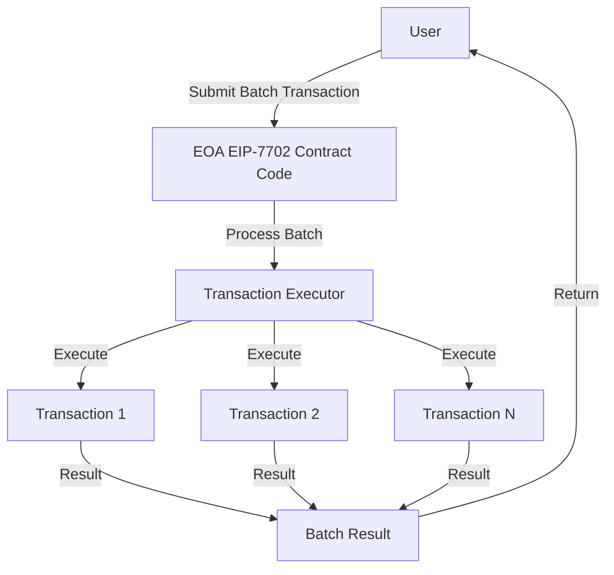
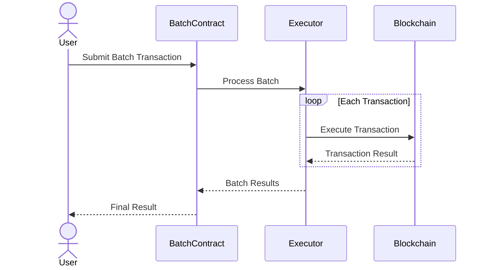

---
head:
  - - meta
    - property: og:title
      content: EIP-7702 Batch Transactions
  - - meta
    - name: description
      content: Guide to batch transactions using EIP-7702 on Berachain.
  - - meta
    - property: og:description
      content: Guide to batch transactions using EIP-7702 on Berachain.
---

# EIP-7702 Batch Transactions

This guide covers how to perform batch transactions using EIP-7702 on Berachain, focusing on direct user-submitted transactions. Sponsorship (where a third party submits the transaction) is not implemented here, but is possible with EIP-7702.

> **Note:** The main guide and code examples will be maintained at [https://github.com/berachain/guides/tree/main/apps/batch-transactions](https://github.com/berachain/guides/tree/main/apps/batch-transactions).
>
> For a deeper understanding of EIP-7702 and temporary smart account upgrades, see [EIP-7702 Basics](/developers/guides/eip7702-basics).

## Overview

_Batch transactions_ allow you to execute multiple operations in a single EIP-7702 session, improving efficiency and reducing gas costs. This guide walks through the concepts, use cases, and implementation patterns for batch transactions with EIP-7702.

## Key Benefits

- Significantly reduced gas costs
- Atomic transaction execution
- Improved user experience
- Reduced network load

## What is EIP-7702?

EIP-7702 is a proposed Ethereum Improvement Proposal that introduces a new transaction type for batching multiple operations. It enables users to combine multiple transactions into a single transaction, reducing gas costs and improving efficiency. The proposal is designed to be backward compatible with existing Ethereum infrastructure while providing enhanced functionality for batch operations.

## Comparison Table

| Feature                   | EIP-7702 + EIP-5792 | Multicall3 | Permit2 | Meta-tx + Forwarder | EIP-4337 + Bundlers |
| ------------------------- | ------------------- | ---------- | ------- | ------------------- | ------------------- |
| Transaction Batching      | ✅ Yes              | ✅ Yes     | ❌ No   | ✅ Yes              | ✅ Yes              |
| Gas Optimization          | ✅ High             | ⚠️ Medium  | ✅ High | ⚠️ Medium          | ⚠️ Medium          |
| Atomic Execution          | ✅ Yes              | ✅ Yes     | ✅ Yes  | ❌ No               | ✅ Yes              |
| Backward Compatibility    | ✅ Yes              | ✅ Yes     | ⚠️ Limited | ⚠️ Limited       | ❌ No               |
| Implementation Complexity | ⚠️ Medium           | ✅ Low     | ⚠️ Medium | ⚠️ High           | ⚠️ High            |
| Gas Cost per Operation    | ✅ Lowest           | ⚠️ Medium  | ✅ Low  | ⚠️ Medium          | ⚠️ Medium          |
| Trust Assumptions         | ✅ None             | ⚠️ Low     | ✅ None | ❌ High             | ⚠️ Medium          |
| Frontend Integration      | ✅ Native           | ⚠️ Manual  | ✅ Native | ⚠️ Manual         | ⚠️ Complex         |
| Token Support             | ✅ All              | ✅ All     | ❌ ERC20 Only | ✅ All        | ✅ All             |
| Setup Requirements        | ✅ Minimal          | ✅ Minimal | ⚠️ Medium | ⚠️ High           | ❌ Complex          |

## Why These Ratings?

- **Transaction Batching:** EIP-7702 + EIP-5792 provides native batching with frontend support. Multicall3 and Meta-tx + Forwarder support batching but with different limitations. Permit2 doesn't support batching but enables gasless approvals. EIP-4337 + Bundlers supports batching but requires complex setup.

- **Gas Optimization:** EIP-7702 + EIP-5792 and Permit2 offer high gas optimization through native batching and gasless approvals respectively. Multicall3, Meta-tx + Forwarder, and EIP-4337 + Bundlers provide medium optimization due to additional overhead or complexity.

- **Atomic Execution:** EIP-7702 + EIP-5792, Multicall3, Permit2, and EIP-4337 + Bundlers all support atomic execution. Meta-tx + Forwarder doesn't guarantee atomicity due to its relay-based nature.

- **Backward Compatibility:** EIP-7702 + EIP-5792 and Multicall3 maintain high compatibility with existing infrastructure. Permit2 and Meta-tx + Forwarder have limited compatibility due to specific token standards or relay requirements. EIP-4337 + Bundlers requires significant infrastructure changes.

- **Implementation Complexity:** Multicall3 is simplest to implement. EIP-7702 + EIP-5792 and Permit2 require medium complexity. Meta-tx + Forwarder and EIP-4337 + Bundlers require high complexity due to relay infrastructure or account abstraction.

- **Gas Cost per Operation:** EIP-7702 + EIP-5792 offers lowest per-operation cost through native batching. Permit2 provides low costs through gasless approvals. Other solutions have medium costs due to additional overhead.

- **Trust Assumptions:** EIP-7702 + EIP-5792 and Permit2 require no trust assumptions. Multicall3 has low trust requirements. Meta-tx + Forwarder requires high trust in relayers. EIP-4337 + Bundlers requires medium trust in bundlers.

- **Frontend Integration:** EIP-7702 + EIP-5792 and Permit2 offer native frontend integration. Multicall3 and Meta-tx + Forwarder require manual integration. EIP-4337 + Bundlers requires complex integration.

- **Token Support:** EIP-7702 + EIP-5792, Multicall3, Meta-tx + Forwarder, and EIP-4337 + Bundlers support all token types. Permit2 is limited to ERC20 tokens.

- **Setup Requirements:** EIP-7702 + EIP-5792 and Multicall3 require minimal setup. Permit2 requires medium setup for token integration. Meta-tx + Forwarder requires high setup for relay infrastructure. EIP-4337 + Bundlers requires complex setup for account abstraction.

## Architecture

The architecture diagram below shows the high-level flow of batch transactions. Each component plays a crucial role in ensuring atomic execution and proper error handling.



## Transaction Flow

The sequence diagram below illustrates how batch transactions are processed, from submission to final result. Each step is crucial for maintaining atomicity and proper error handling. **Sponsorship is not implemented in this guide, but is possible with EIP-7702.**



## Implementation

::: code-group

```solidity [BatchTransaction.sol]
// SPDX-License-Identifier: MIT
pragma solidity ^0.8.20;
/**
 * @notice VULNERABLE, UNAUDITED CODE. DO NOT USE IN PRODUCTION.
 */
contract BatchTransaction {
    struct Call {
        address to;
        uint256 value;
        bytes data;
    }

    function execute(Call[] calldata calls) external payable {
        require(msg.sender == address(this), "EIP-7702: only self-call allowed");
        for (uint256 i = 0; i < calls.length; i++) {
            (bool success, ) = calls[i].to.call{value: calls[i].value}(calls[i].data);
            require(success, "Call failed");
        }
    }
}
// See the full contract at: https://github.com/berachain/guides/blob/main/apps/batch-transactions/src/BatchTransaction.sol
```

```typescript [usage.ts]
// Example usage with viem and EIP-7702 signing
import { createWalletClient, http, parseEther, encodeFunctionData } from "viem";
import { privateKeyToAccount } from "viem/accounts";
import { eip7702Actions } from "viem/experimental";
import { batchABI, batchContractAddress } from "./abi";

const account = privateKeyToAccount("0xYOUR_PRIVATE_KEY");
const client = createWalletClient({
  account,
  chain: {
    id: 1337,
    name: "Local",
    rpcUrls: { default: { http: ["http://localhost:8545"] } },
  },
  transport: http(),
}).extend(eip7702Actions());

// Prepare your batch of calls
const calls = [
  {
    to: "0xContract1",
    value: parseEther("0"),
    data: "0x...", // encoded function data
  },
  // ... more calls
];

// Sign EIP-7702 authorization
const authorization = await client.signAuthorization({
  account,
  contractAddress: batchContractAddress,
  executor: "self", // for direct execution
});

// Encode the batch call
const data = encodeFunctionData({
  abi: batchABI,
  functionName: "execute",
  args: [calls],
});

// Send the EIP-7702 transaction to the EOA address
await client.sendTransaction({
  authorizationList: [authorization],
  data,
  to: account.address,
});

// For a full working script, see:
// https://github.com/berachain/guides/blob/main/apps/batch-transactions/script/deploy-and-execute.js
```

:::

## Benefits

1. **Gas Efficiency**: Significantly reduces gas costs by combining multiple transactions into one
2. **Atomic Execution**: All transactions in a batch either succeed or fail together
3. **Improved User Experience**: Users can perform multiple operations in a single transaction
4. **Reduced Network Load**: Fewer transactions on the network means better overall performance

## Use Cases

- DeFi operations requiring multiple steps
- NFT batch minting and transfers
- Complex smart contract interactions
- Multi-step protocol operations

## Security Considerations

1. **Gas Limits**: Ensure batch size doesn't exceed block gas limits
2. **Transaction Ordering**: Maintain proper transaction ordering for dependent operations
3. **Error Handling**: Implement proper error handling for failed transactions
4. **Access Control**: Implement appropriate access control mechanisms

## Best Practices

1. Validate all transaction parameters before execution
2. Implement proper error handling and rollback mechanisms
3. Consider gas costs when determining batch size
4. Test thoroughly with different batch sizes and transaction types
5. Monitor and optimize gas usage

## Next Steps

To get started with EIP-7702 batch transactions:

1. Review the implementation example above
2. Test the batch transaction functionality in a development environment
3. Consider the security implications and best practices
4. Integrate batch transactions into your application where appropriate

## Related Resources

- [EIP-7702 Specification](https://eips.ethereum.org/EIPS/eip-7702)
- [EIP-5792 (Account Abstraction)](https://eips.ethereum.org/EIPS/eip-5792)
- [EIP-7702 Basics Guide](/developers/guides/eip7702-basics)
- [BatchTransaction.sol on GitHub](https://github.com/berachain/guides/blob/main/apps/batch-transactions/src/BatchTransaction.sol)
- [deploy-and-execute.js on GitHub](https://github.com/berachain/guides/blob/main/apps/batch-transactions/script/deploy-and-execute.js)
