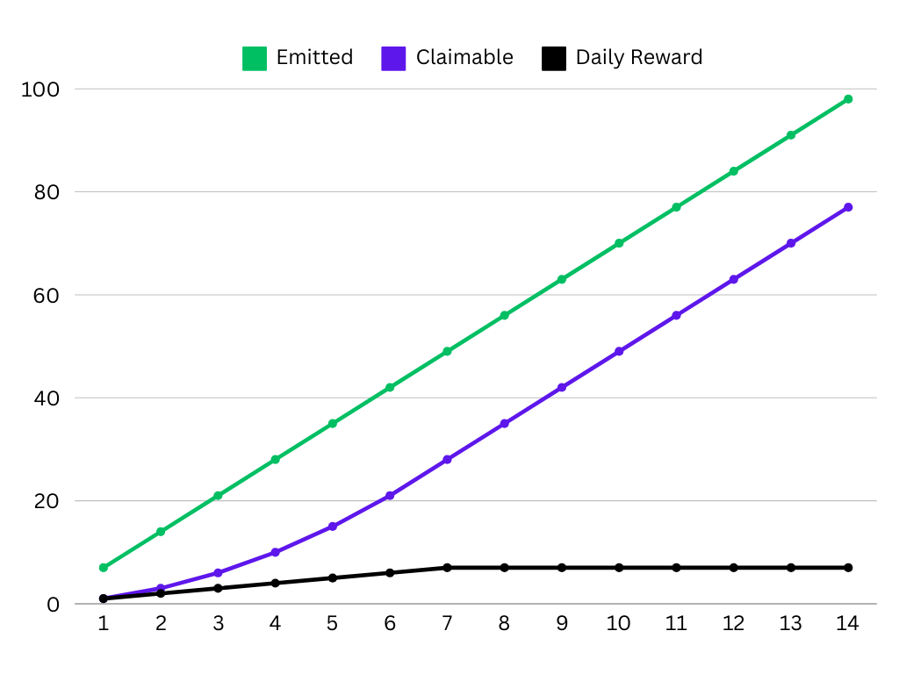

# Block Production & Rewards

Proof-of-Liquidity governs block rewards and token emissions on Berachain using the `$BGT` token. This page explains the mathematical principles behind validator selection, block rewards, and emissions calculations.

## Validator Selection

The network maintains an active set of **{{ config.mainnet.validatorActiveSetSize }} validators** who are eligible for block production. Selection criteria include:

- Only top **{{ config.mainnet.validatorActiveSetSize }} validators** by `$BERA` stake are included in active set
- Block proposal probability is proportional to staked `$BERA` and does not affect reward amounts
- Stake limitations per validator:
  - Minimum: {{ config.mainnet.minActivationBalance.toLocaleString() }} `$BERA`
  - Maximum: {{ config.mainnet.maxDepositBalance.toLocaleString() }} `$BERA`

A given Validator's probability of being selected to produce a block is the proportion of its stake's weight to the total stakes of the active set.

## $BGT Emissions Structure

When a validator produces a block, `$BGT` tokens are emitted through two emission components:

1. Base Emission
   - **Fixed amount** equal to a `base rate` parameter (B)
   - Paid directly to block-producing validator

2. Reward Vault Emission
   - **Variable amount** dependent on validator's boost (x)
     - i.e. percentage of total `$BGT` delegated to the validator
   - Distributed to [Reward Vaults](/learn/pol/rewardvaults) selected by validator
     - Proportional to weights configured in the validator's [Reward Allocation](/nodes/guides/reward-allocation)
     - Validators receive [Incentives](/learn/pol/incentives) from projects based on amounts directed to their Reward Vaults

## Validator Boosts

Boost is a crucial metric that determines a validator's reward emissions:

- Calculated as the percentage of `$BGT` delegation a validator has compared to the total `$BGT` delegated in the network
- Expressed as a decimal between 0 and 1
- Example: If a validator has 1000 `$BGT` delegated and the network has 10000 total `$BGT` delegated, their boost would be 0.1 (10%).
  Higher boost leads to higher reward emissions, subject to the emission formula.

## BeraChef: Reward Allocation Management

BeraChef is the core contract that manages how validators direct their BGT rewards across different Reward Vaults. It serves as the configuration layer that determines reward distribution based on validator preferences.

### Core Responsibilities

BeraChef manages three key aspects of the reward system:

1. **Reward Allocations** - Maintains lists of weights that determine the percentage of rewards going to each Reward Vault
2. **Vault Whitelisting** - Controls which vaults are eligible to receive BGT rewards
3. **Validator Commission** - Manages commission rates that validators can charge on incentive tokens

### How Reward Allocations Work

Each validator can set a custom reward allocation that specifies how their BGT rewards should be distributed across different Reward Vaults. If a validator doesn't set a custom allocation, a default allocation is used.

**Reward Allocation Structure:**

- **Weights**: Percentage allocations to different vaults (must sum to 100%)
- **Start Block**: When the allocation becomes effective
- **Delay Period**: Time buffer before allocations can be changed

**Validator Control:**

- Queue new reward allocations with a specified delay
- Modify commission rates on incentive tokens (capped at 20%)
- Change allocations following governance-imposed delay periods

### Commission Management

BeraChef manages validator commission rates on incentive tokens with the following constraints:

- **Default Commission**: 5% if not explicitly set
- **Maximum Commission**: 20% hard cap enforced by the contract
- **Change Delay**: Required waiting period before commission changes take effect

### Integration with Block Rewards

When a validator produces a block, BeraChef determines:

1. Which Reward Vaults receive the variable BGT emission
2. The proportion each vault receives based on the validator's allocation weights
3. The commission the validator earns on any incentive tokens from those vaults

For detailed validator operations, see:

- [Managing Validator Reward Allocations](/nodes/guides/reward-allocation)
- [Setting Commission Rates](/nodes/guides/manage-incentives-commission)

## $BGT Emissions Per Block

The total `$BGT` emitted per block is calculated using the following formula:

$$emission = \left[B + \max\left(m, (a + 1)\left(1 - \frac{1}{1 + ax^b}\right)R\right)\right]$$

### Parameters

| Parameter                       | Description                                                    | Impact                                         |
| ------------------------------- | -------------------------------------------------------------- | ---------------------------------------------- |
| x (boost)                       | Fraction of total `$BGT` delegated to validator (range: [0,1]) | Determines `$BGT` emissions to Reward Vaults   |
| B (base rate)                   | Fixed amount of `$BGT` for block production                    | Determines baseline validator rewards          |
| R (reward rate)                 | Base `$BGT` amount for reward vaults                           | Sets foundation for reward emissions           |
| a (boost multiplier)            | Boost impact coefficient                                       | Higher values increase boost importance        |
| b (convexity parameter)         | Boost impact curve steepness                                   | Higher values penalize low boost more severely |
| m (minimum boosted reward rate) | Floor for reward vault emissions                               | Higher values benefit low-boost validators     |

### Sample Emissions Chart

Using the following sample parameters, we can visualize how emissions scale with `$BGT` delegation:
$$B = 0.4, R = 1.1, a = 3.5, b = 0.4, m = 0$$

  

## Max Block Inflation

`$BGT` emissions grow with the amount of boost a validator has, up to a cap. The maximum theoretical block emission occurs at 100% boost:

$$\max \mathbb{E}[\text{emission}] = \left[B + \max(m, aR)\right]$$

## `$BGT` Distribution

`$BGT` is emitted to reward vaults on a per-block basis via the [Distributor](../../developers/contracts/distributor.md). Distributions for a given block are performed during processing
for the following block. Distribution creates `$BGT` that is then claimable by [Reward Vault](../pol/rewardvaults.md) stakers.

Rewards are created on a per-block basis; however, the distribution of rewards is done **over a three-day period.** Rewards are streamed linearly over this period to depositors proportionally to their deposit amounts. The reward window is reset each time new rewards are added.

### Distribution Example

On Berachain, `$BGT` is distributed per block, meaning that the three-day distribution period is consistently being pushed to "start" on the current block. Thus, this period should be viewed as a sliding window based on the emissions at any given time during the previous three days.

A more real-world example with simplified numbers can be used to understand distribution currently (taking place over 9 days):

- 3 `$BGT` distributed daily, for a total of 27 over 9 days
- 1 depositor, owning all the deposits

The distribution graph would be as follows:

**Legend**

- Emitted: Total number of `$BGT` distributed and available
- Claimable: Total number of `$BGT` able to be claimed by depositors
- Daily Reward: Daily number of `$BGT` marked as claimable based on emitted tokens unlocks

This results in the depositor receiving an increasing amount of `$BGT` daily until rewards reach a saturation point after three days where all rewards are actively being distributed.
Given that rewards are distributed on a frequent basis, the reward rate on a new reward vault should normalize after the initial three-day period.

Reward duration periods incentivize ecosystem alignment with depositors via this distribution mechanism rather than allowing rewards to be instantly claimed.

## Calculating Boost APR

Boost APR is shown throughout the [Berachain Hub](https://hub.berachain.com).

Boost APR % is calculated using ranges of blocks, defined by a starting block and an ending block. At the time the percentages are calculated, the APR calculator samples the prices of all tokens (in $BERA).

Initial variables:

- $R_c$ : cycle rate
- $B_s$ : starting block
- $t_{B_s}$ : timestamp of starting block
- $B_e$ : ending block
- $t_{B_e}$ : timestamp of ending block
- $IT$ : incentive token
- $P_{T,t_{B_e}}$ : price of token $T$ at the end time of the block range

These variables are collected for the particular validator:

- $I_{T,b}$ : incentive amount received by validator at given block $b$ per given token $T$
- $Boost_{t_{B_e}}$
  : total BGT boost of the validator at ending time of the block range

Then, the $APR$ for that validator is the sum over the range of all received incentives priced at the end time of the block range, divided by the total boost at the end time, priced with BERA price at final time, annualized.

$$ R*c = \frac{\sum*{T∈IT}\Big(\sum*{b = B_s}^{B_e} I*{T,b}\Big) \times P*{T,t*{B*e}}} {Boost*{t*{B_e}} \times P*{BERA,t\_{B_e}}} $$

$$ APR = R*c \times \frac{{T*{year}}}{t*{B_e} - t*{B_s}} $$

Note that by “incentive received” we only consider incentives distributed by the RewardVault to the BGTIncentiveDistributor, tracked by the event BGTBoosterIncentivesProcessed (see contract code).

Amount in this calculation is net of commission, so per token it’s given by:

$$ I\_{T,b} = IR_T \times DistributedBGT \times (1 - C) $$

with:

- $IR_T$ : incentive rate of token $T$
- $C$ : validator commission on incentives
