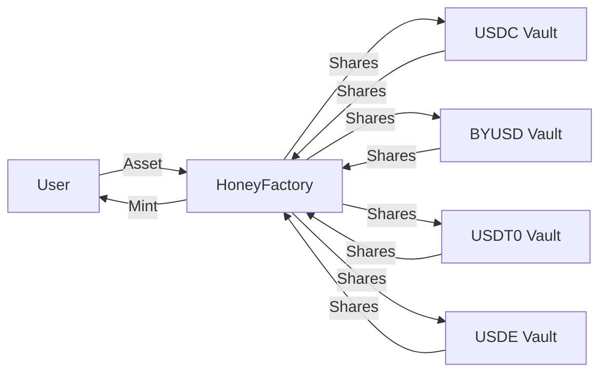

---
head:
  - - meta
    - property: og:title
      content: $Honey Stablecoin
  - - meta
    - name: description
      content: What Is $Honey Stablecoin
  - - meta
    - property: og:description
      content: What Is $Honey Stablecoin
---

# $HONEY

> <small><a target="_blank" :href="config.websites.berascan.url + 'address/' + config.contracts.tokens.honey.address.berachainMainnet">{{config.contracts.tokens.honey.address.berachainMainnet}}</a></small>

<ClientOnly>
  <Token title="$HONEY" image="/assets/HONEY.png" />
</ClientOnly>

`$HONEY` is Berachain's native stablecoin, designed to provide a stable and reliable means of exchange within the Berachain ecosystem and beyond. `$HONEY` is fully collateralized and soft-pegged to the US Dollar.

## How to Get $HONEY

`$HONEY` can be minted by depositing whitelisted collateral into a vault and minting `$HONEY` against that collateral through the <a :href="config.websites.honeySwap.url">HoneySwap dApp</a>. The minting rates of `$HONEY` are configurable by `$BGT` governance for each different collateral asset.

Alternatively, `$HONEY` can be obtained by swapping from other assets on [BEX](/learn/dapps/bex) or another decentralized exchange.

### Collateral Assets

The following assets can be used as collateral to mint `$HONEY`:

- `$USDC`
- `$BYUSD` (`$pyUSD`)
- `$USDT0`
- `$USDE`

New assets used to mint `$HONEY` can be added through governance.

## How is $HONEY Used?

`$HONEY` shares the same uses as other stablecoins, such as for payments/remittances and as a hedge against market volatility. `$HONEY` can also be used within the Berachain DeFi ecosystem.

## $HONEY Architecture

A flow diagram of the `$HONEY` minting process and associated contracts is shown below:

### $HONEY Vaults

`$HONEY` is minted by depositing eligible collateral into specialized vault contracts. Each vault is specific to a particular collateral type. Currently, all vaults use the same conversion rates: 100% mint rate (0% mint fee) and 99.95% redeem rate (0.05% redeem fee).

### HoneyFactory

At the heart of the `$HONEY` minting process is the HoneyFactory contract. This contract acts as a central hub, connecting all the different `$HONEY` Vaults and is responsible for minting new `$HONEY` tokens.

As shown in the diagram, users' deposits are routed through the `HoneyFactory` contract to the appropriate vault. The `HoneyFactory` custodies the shares minted by the vault (corresponding to users' deposits) and mints `$HONEY` tokens to the user.

## Depegging and Basket Mode

Basket Mode is a safety mechanism that activates when collateral assets become unstable. It affects both minting and redemption of `$HONEY` in specific ways:

**Redemption:**

- When ANY collateral asset depegs, Basket Mode automatically activates
- In this mode, users can't choose which asset they redeem their `$HONEY` for
- Instead, users redeem for a proportional share of ALL collateral assets in the basket
- For example, if you redeem 1 `$HONEY` token with Basket Mode active, you'll get some of each collateral asset based on their relative proportion as collateral:
  - Some `$USDC`
  - Some `$BYUSD` (`$pyUSD`)
  - Some `$USDT0`
  - Some `$USDE`

**Minting:**

- Basket Mode for minting is considered an edge case that only occurs if ALL collateral assets are either depegged or blacklisted. Depegged assets cannot be used to mint `$HONEY`
- In this situation, to mint `$HONEY`, users must provide proportional amounts of all collateral assets in the basket, rather than choosing a single asset
- If one asset is depegged, you can mint only with the other asset

### Why Proportional Redemptions

Basket mode prevents selective exits when collateral becomes unstable. Redemptions are always proportional across all assets in the basket, so users cannot redeem only healthy collateral and leave depegged exposure to others. The protocol distributes depeg risk across the full collateral set.

### Collateral Caps

The HoneyFactory enforces global and relative caps on collateral weights. These limits apply to mint, redeem, recapitalize, and liquidate operations and keep the basket composition within configured bounds.

Paused vaults remain included in cap calculations (except when marked as bad collateral). Users cannot mint or redeem paused collateral directly, but its weight can decrease when users mint with other collaterals outside basket mode. The `liquidate` function uses a separate weight calculation that filters bad collateral, so liquidation remains available even when paused collateral affects mint and redeem cap checks.

On mainnet, caps are currently disabled by foundation configuration.

## Fees

Fees collected from minting and redeeming `$HONEY` are distributed to `$BGT` holders. The current fee structure is the following:

| Stablecoin | Mint Fee | Redeem Fee |
| ---------- | -------- | ---------- |
| USDT       | 0.1%     | 0%         |
| byUSD      | 0.1%     | 0%         |
| USDC       | 0%       | 0.05%      |
| USDe       | 0%       | 0.05%      |

### Example

Let's walk through minting and redeeming `$HONEY` with `$USDC`:

**Minting:**

- User deposits `1,000 $USDC`
- Receives `1,000 $HONEY` (0% fee)
- No fees collected

**Redeeming:**

- User redeems `1,000 $HONEY` for `$USDC`
- Receives `999.5 $USDC` (0.05% fee = 0.5 $USDC)
- `0.5 $USDC` fee is distributed to `$BGT` holders
