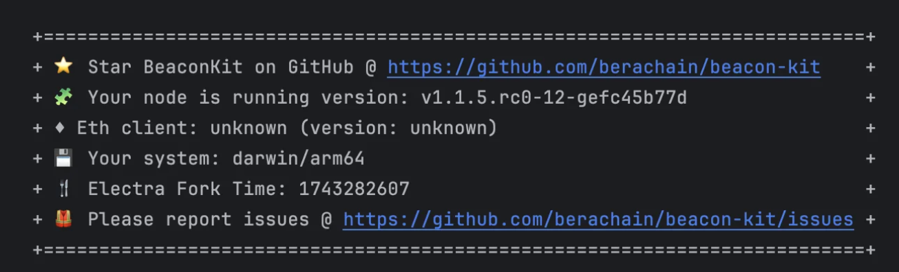

---
head:
  - - meta
    - property: og:title
      content: Bectra Hardfork
---

# Bectra Hardfork

Bectra introduces two changes to Berachain:

1. Validators are able to withdraw all or part of their $BERA stake.
2. All users are able to take advantage of [EIP 7702](https://github.com/ethereum/EIPs/blob/master/EIPS/eip-7702.md) for an improved wallet experience.

We are staging this release, first to our Bepolia testnet, and then to Berachain Mainnet.
The timing of upgrades to Mainnet will be confirmed after we get operational experience with the Bepolia upgrade, but are **tentatively set for May 28**.

Note all users, whether hosting an RPC or a validator, **must upgrade** their Execution Client and Consensus Client to continue following the chain.

The following execution client versions are tested with this upgrade

- [Geth 1.15.9](https://github.com/ethereum/go-ethereum/releases/tag/v1.15.9)
- [Reth 1.3.12](https://github.com/paradigmxyz/reth/releases/tag/v1.3.12)
- [Nethermind 1.31.8](https://github.com/NethermindEth/nethermind/releases/tag/1.31.8)
- [Besu 25.4.1](https://github.com/hyperledger/besu/releases/tag/25.4.1)
- [Erigon 3.0.2](https://github.com/erigontech/erigon/releases/tag/v3.0.2)

## Bepolia Upgrade

- **Week of April 21**: Documentation released.
- **Monday April 28**: Beacon Kit 1.2.0-rc released. Node operators upgrade Beacon Kit and geth/reth/etc.
- **Monday May 5**: All infrastructure partners and public RPCs are expected to be upgraded.
- **May 7 at 10am Eastern**: Bectra hardfork on Bepolia

With experience from Bepolia, we will plan the release to mainnet, tentatively set for May 28.

### Execution Client Upgrade Week of April 28

The first upgrade is to the Execution Client, to enable new operations that are enabled at the designated fork activation time.

1. For [reth, geth, besu, erigon]:

   ```bash
   wget https://raw.githubusercontent.com/berachain/beacon-kit/refs/heads/main/testing/networks/80069/eth-genesis.json
   md5 eth-genesis.json
   ```

   The hash should be `fixme`.

2. For Nethermind:

   ```bash
   wget https://raw.githubusercontent.com/berachain/beacon-kit/refs/heads/main/testing/networks/80069/eth-nether-genesis.json
   md5 eth-nether-genesis.json
   ```

   The hash should be `fixme`.

3. Deploy this genesis file, along with the upgraded Execution Client binary.

4. Geth requires additional steps (see below). Other execution clients automatically load and apply a new genesis file.

5. Check the Execution Layer log for indications of successful enabling of the fork.  
   

### Geth special instructions

Unlike most clients, `geth` does not automatically read an updated genesis file. To apply the new genesis file, do the following on the RPC or Validator:

```bash
/path/to/geth init --datadir /path/to/geth/data /path/to/eth-genesis.json
```

The `datadir` should contain at least two directories, `keystore` and `geth`, with the latter containing directories such as `blobpool` and `chaindata`.

If your node is an archive node, and ordinarily runs with `--state.scheme hash`, then you must provide that option to `geth init` as well.

### Beacon Kit Upgrade

The hardfork timestamp is baked into `beacond` at compile time.

**No changes are required for `beacond` options or configuration.**

The following will be logged on `beacond` startup.



Note the version number and "Electra Fork Time" in the banner.
