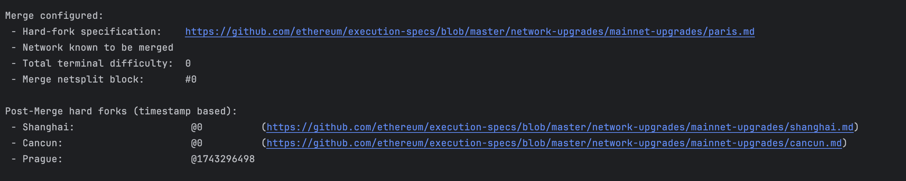

---
head:
  - - meta
    - property: og:title
      content: Upgrading Beacon Kit for a Hard Fork
---


# Node Operator Guide for Bectra Upgrade


## Beacon Kit Upgrade

All Validators and full nodes will need to run the latest version of Beacon Kit at the time of the fork. Any validators or full nodes not running the latest version of Beacon Kit will not progress and get stuck at the hard fork time.

The hardfork timestamp is baked into `beacond` at compile time.

**No changes are required for `beacond` options or configuration.**

The following will be logged on `beacond` startup.


Note the version number and "Electra Fork Time" in the banner.

## Execution Client Upgrade

The following execution client versions are tested with this upgrade
* Reth version 1.fixme 
* Geth version 2.fixme
* Nethermind version 3.fixme
* Erigon version 4.fixme
* Besu version 5.fixme

### geth, reth, ergion, besu

Fetch a new genesis file from https://raw.githubusercontent.com/berachain/beacon-kit/refs/heads/main/testing/networks/80094/eth-genesis.json 

Verify its signature:
`md5 eth-genesis.json` should show **fixme**.

Deploy this new genesis file along with the version of your execution client mentioned above.


**Geth** instructions fixme

Geth should show a banner like this on startup. Note the Prague hardfork timestamp:


**Reth** accepts the chainspec path on the command line.  Replace the file specified to `--chain` in the Reth command line:
```
$RETH_BIN node 					\
	--datadir $RETH_DATA			\
	--chain $RETH_GENESIS_PATH		\
```
Reth will show this banner on startup:


### nethermind

Fetch a new genesis file from https://raw.githubusercontent.com/berachain/beacon-kit/refs/heads/main/testing/networks/80094/eth-nether-genesis.json

Verify its signature:
`md5 eth-nether-genesis.json` should show **fixme**.

Nethermind uses its config file to identify the Genesis file, in the `Init` section, `ChainSpecPath` setting.
Deploy this new genesis file along with the Nethermind version mentioned above. 


On startup, nethermind will log the following to indicate the hardfork is ready:

