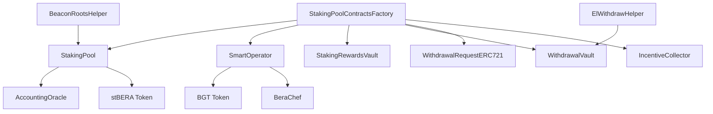

---
head:
  - - meta
    - property: og:title
      content: Staking Pools Smart Contract Reference
  - - meta
    - name: description
      content: Complete technical reference for Berachain staking pools smart contracts, including interfaces, functions, events, and implementation details
  - - meta
    - property: og:description
      content: Complete technical reference for Berachain staking pools smart contracts, including interfaces, functions, events, and implementation details
---

# Staking Pools Smart Contract Reference

This technical reference covers all smart contracts in the Berachain staking pools system, including their interfaces, functions, events, and implementation details.

## Contract Architecture

The staking pools system consists of several interconnected contracts deployed via a factory pattern:



## Core Contracts

### StakingPoolContractsFactory

The factory contract that deploys all staking pool components using beacon proxies.

#### Interface

```solidity
interface IStakingPoolContractsFactory {
    function deployStakingPoolContracts(
        bytes memory pubkey,
        address validatorAdmin,
        address defaultSharesRecipient
    ) external returns (
        address smartOperator,
        address stakingPool,
        address stakingRewardsVault,
        address withdrawalRequestERC721,
        address withdrawalVault,
        address incentiveCollector
    );

    function activateStakingPool(
        bytes memory pubkey,
        bytes memory withdrawalCredentials,
        bytes memory pubkeyProof,
        bytes memory withdrawalCredentialsProof,
        uint256 validatorIndex,
        uint256 amount
    ) external payable;

    function getCoreContracts(bytes memory pubkey) external view returns (
        address smartOperator,
        address stakingPool,
        address stakingRewardsVault,
        address withdrawalRequestERC721,
        address withdrawalVault,
        address incentiveCollector
    );
}
```

#### Key Functions

**deployStakingPoolContracts**

- Deploys all required contracts for a new staking pool
- Uses beacon proxy pattern for upgradability
- Sets up proper inter-contract connections
- Configures initial admin roles

**activateStakingPool**

- Activates a deployed staking pool with initial deposit
- Verifies beacon proofs for validator setup
- Enables user deposits after successful activation
- Must be called by validator admin

**getCoreContracts**

- Returns addresses of all contracts for a given validator pubkey
- Used for discovering deployed contract addresses
- Public view function for integration

#### Events

```solidity
event StakingPoolContractsDeployed(
    bytes indexed pubkey,
    address smartOperator,
    address stakingPool,
    address stakingRewardsVault,
    address withdrawalRequestERC721,
    address withdrawalVault,
    address incentiveCollector
);

event StakingPoolActivated(
    bytes indexed pubkey,
    uint256 validatorIndex,
    uint256 initialDeposit
);
```

### StakingPool

The core staking pool contract that manages user deposits and stBERA tokens.

#### Interface

```solidity
interface IStakingPool {
    function submit() external payable returns (uint256 shares);
    function requestWithdrawal(
        uint256 amount,
        uint256 maxFeePayable
    ) external returns (uint256 requestId);

    function totalAssets() external view returns (uint256);
    function totalShares() external view returns (uint256);
    function balanceOf(address account) external view returns (uint256);
    function sharesOf(address account) external view returns (uint256);

    function pause() external;
    function unpause() external;
    function paused() external view returns (bool);

    function triggerFullExit() external;
    function isFullExited() external view returns (bool);
}
```

#### Key Functions

**submit**

- Accepts BERA deposits and mints stBERA tokens
- Calculates shares based on current exchange rate
- Automatically deposits to consensus layer when thresholds met
- Restricted when paused or at capacity

**requestWithdrawal**

- Creates withdrawal request NFT
- Burns stBERA tokens
- Triggers EIP-7002 consensus layer withdrawal
- Implements dynamic fee handling

**totalAssets**

- Returns total BERA value managed by pool
- Includes buffered assets, staked assets, and rewards
- Used for calculating share prices

**pause/unpause**

- Emergency controls for governance
- Pauses new deposits but allows withdrawals
- Part of upcoming admin pausability feature

**triggerFullExit**

- Forces pool to exit all positions
- Triggered automatically when below minimum balance
- Can be called manually by governance

#### Events

```solidity
event Deposit(address indexed user, uint256 amount, uint256 shares);
event WithdrawalRequested(
    address indexed user,
    uint256 requestId,
    uint256 amount,
    uint256 fee
);
event FullExitTriggered(uint256 totalAssets);
event Paused(address account);
event Unpaused(address account);
```

### SmartOperator

Manages validator operations and BGT token handling.

#### Interface

```solidity
interface ISmartOperator {
    function queueBoost() external;
    function activateBoost() external;
    function queueDropBoost() external;
    function activateDropBoost() external;

    function queueRewardsAllocation(
        uint256 startBlock,
        IBeraChef.Weight[] memory weights
    ) external;

    function queueValCommission(uint256 commission) external;

    function balanceOfBGT() external view returns (uint256);
    function unboostedBalance() external view returns (uint256);
    function getStakerRewards() external view returns (uint256);

    function redeem(address receiver, uint256 amount) external;
}
```

#### Key Functions

**queueBoost/activateBoost**

- Manages BGT boosting operations
- Queue mechanism with delay for security
- Automatically boosts validator for additional rewards

**queueRewardsAllocation**

- Configures reward distribution weights
- Sets up cutting board for BGT rewards
- Managed by validator admin

**queueValCommission**

- Sets validator commission rate
- Affects reward distribution to stakers
- Subject to governance limits

**redeem**

- Redeems BGT tokens for BERA
- Used during emergencies or full exits
- Governance-controlled function

#### Events

```solidity
event BoostQueued(uint256 amount, uint256 activationBlock);
event BoostActivated(uint256 amount);
event DropBoostQueued(uint256 activationBlock);
event DropBoostActivated(uint256 amount);
event RewardsAllocationQueued(uint256 startBlock);
event CommissionQueued(uint256 commission, uint256 activationBlock);
event BGTRedeemed(address indexed receiver, uint256 amount);
```

### WithdrawalRequestERC721

NFT-based withdrawal request system implementing EIP-7002.

#### Interface

```solidity
interface IWithdrawalRequestERC721 {
    function requestWithdrawal(
        uint256 amount,
        uint256 maxFeePayable
    ) external returns (uint256 requestId);

    function finalizeWithdrawalRequest(uint256 requestId) external;
    function finalizeWithdrawalRequests(uint256[] calldata requestIds) external;

    function getWithdrawalRequest(uint256 requestId) external view returns (
        uint256 amount,
        uint256 fee,
        uint256 timestamp,
        bool finalized
    );

    function isWithdrawalFinalized(uint256 requestId) external view returns (bool);
}
```

#### Key Functions

**requestWithdrawal**

- Creates NFT representing withdrawal claim
- Triggers EIP-7002 withdrawal request
- Implements dynamic fee calculation
- Burns stBERA tokens

**finalizeWithdrawalRequest**

- Processes completed withdrawal
- Transfers BERA to user
- Refunds excess fees
- Burns withdrawal NFT

**getWithdrawalRequest**

- Returns withdrawal request details
- Shows fee paid and finalization status
- Used for tracking withdrawal progress

#### Events

```solidity
event WithdrawalRequested(
    address indexed user,
    uint256 indexed requestId,
    uint256 amount,
    uint256 fee
);
event WithdrawalFinalized(
    address indexed user,
    uint256 indexed requestId,
    uint256 amount,
    uint256 refund
);
```

### WithdrawalVault

Manages consensus layer withdrawals and EIP-7002 processing.

#### Interface

```solidity
interface IWithdrawalVault {
    function processWithdrawals() external;
    function claimExcessFees() external;

    function getTotalWithdrawals() external view returns (uint256);
    function getAvailableBalance() external view returns (uint256);
    function getExcessFees() external view returns (uint256);
}
```

#### Key Functions

**processWithdrawals**

- Processes incoming consensus layer withdrawals
- Distributes funds to pending withdrawal requests
- Handles automatic fee refunds

**claimExcessFees**

- Withdraws excess withdrawal fees
- Transfers to rewards vault for distribution
- Governance-controlled function

#### Events

```solidity
event WithdrawalProcessed(uint256 amount);
event ExcessFeesClaimed(uint256 amount);
```

### StakingRewardsVault

Collects and distributes validator rewards.

#### Interface

```solidity
interface IStakingRewardsVault {
    function collectRewards() external;
    function distributeRewards() external;

    function totalRewards() external view returns (uint256);
    function pendingRewards() external view returns (uint256);
}
```

#### Key Functions

**collectRewards**

- Collects execution layer rewards
- Processes fee splits
- Automated collection process

**distributeRewards**

- Distributes rewards to staking pool
- Increases stBERA value
- Compounds rewards automatically

#### Events

```solidity
event RewardsCollected(uint256 amount);
event RewardsDistributed(uint256 amount);
```

### IncentiveCollector

Auction-based system for selling incentive rewards.

#### Interface

```solidity
interface IIncentiveCollector {
    function auctionIncentives(
        address token,
        uint256 amount,
        uint256 minBeraAmount
    ) external;

    function bidOnAuction(
        uint256 auctionId,
        uint256 beraAmount
    ) external;

    function claimAuction(uint256 auctionId) external;

    function getAuctionDetails(uint256 auctionId) external view returns (
        address token,
        uint256 amount,
        uint256 highestBid,
        address highestBidder,
        uint256 endTime
    );
}
```

#### Key Functions

**auctionIncentives**

- Creates auction for incentive tokens
- Sets minimum BERA price
- Automated by the system

**bidOnAuction**

- Places bid on token auction
- Requires BERA payment
- Competitive bidding process

**claimAuction**

- Claims won auction tokens
- Transfers tokens to winner
- Distributes BERA to pool

#### Events

```solidity
event AuctionCreated(
    uint256 indexed auctionId,
    address indexed token,
    uint256 amount,
    uint256 minBeraAmount
);
event BidPlaced(
    uint256 indexed auctionId,
    address indexed bidder,
    uint256 amount
);
event AuctionClaimed(
    uint256 indexed auctionId,
    address indexed winner,
    uint256 beraAmount
);
```

## Oracle System

### AccountingOracle

Provides consensus layer data for accurate pool accounting.

#### Interface

```solidity
interface IAccountingOracle {
    function feed(
        bytes memory pubkey,
        uint256 newTotalDeposits,
        bool triggerDropBoost,
        uint256 redeemableBGT
    ) external;

    function getValidatorData(bytes memory pubkey) external view returns (
        uint256 totalDeposits,
        uint256 lastUpdate,
        bool isExited
    );

    function addFeeder(address feeder) external;
    function removeFeeder(address feeder) external;
}
```

#### Key Functions

**feed**

- Updates consensus layer data
- Triggers BGT operations if needed
- Called by oracle bots
- Restricted to authorized feeders

**getValidatorData**

- Returns current validator state
- Used for pool accounting
- Public view function

#### Events

```solidity
event OracleDataUpdated(
    bytes indexed pubkey,
    uint256 totalDeposits,
    uint256 timestamp
);
event FeederAdded(address indexed feeder);
event FeederRemoved(address indexed feeder);
```

## Token Contracts

### stBERA

Validator staking share token with share-based mechanics and disabled transfers.

#### Interface

```solidity
interface IStBERA {
    function mint(address to, uint256 amount) external;
    function burn(address from, uint256 amount) external;
    function rebase(uint256 newTotalAssets) external;

    function totalAssets() external view returns (uint256);
    function convertToShares(uint256 assets) external view returns (uint256);
    function convertToAssets(uint256 shares) external view returns (uint256);

    function sharesOf(address account) external view returns (uint256);
    function balanceOf(address account) external view returns (uint256);
}
```

#### Key Functions

**mint/burn**

- Mints/burns stBERA tokens
- Share-based calculation
- Restricted to staking pool

**rebase**

- Updates total assets for reward distribution
- Automatically increases token value
- Called when rewards are distributed

**convertToShares/convertToAssets**

- Converts between shares and assets
- Used for accurate accounting
- Public view functions

**transfer/transferFrom/approve/allowance**

- All transfer-related functions revert with `NotImplemented()` error
- stBERA validator staking shares are permanently non-transferable by design
- Only way to exit position is through withdrawal process

#### Events

```solidity
event Rebase(uint256 newTotalAssets, uint256 newTotalShares);
event Transfer(address indexed from, address indexed to, uint256 value);
event Approval(address indexed owner, address indexed spender, uint256 value);
```

## Helper Contracts

### BeaconRootsHelper

Utilities for beacon block root verification and proof validation.

#### Interface

```solidity
interface IBeaconRootsHelper {
    function verifyPubkeyProof(
        bytes memory pubkey,
        bytes memory proof,
        uint256 validatorIndex
    ) external view returns (bool);

    function verifyWithdrawalCredentialsProof(
        bytes memory withdrawalCredentials,
        bytes memory proof,
        uint256 validatorIndex
    ) external view returns (bool);

    function getBeaconBlockRoot(uint256 timestamp) external view returns (bytes32);
}
```

#### Key Functions

**verifyPubkeyProof**

- Verifies validator pubkey against beacon state
- Uses SSZ proof verification
- Required for pool activation

**verifyWithdrawalCredentialsProof**

- Verifies withdrawal credentials setup
- Ensures proper contract configuration
- Critical for security

### ElWithdrawHelper

Handles EIP-7002 withdrawal request processing.

#### Interface

```solidity
interface IElWithdrawHelper {
    function estimateWithdrawalFee() external view returns (uint256);
    function processWithdrawalRequest(
        uint256 amount,
        uint256 maxFee
    ) external payable returns (uint256 actualFee);

    function refundExcessFee(
        address recipient,
        uint256 paidFee,
        uint256 actualFee
    ) external;
}
```

#### Key Functions

**estimateWithdrawalFee**

- Estimates current EIP-7002 fee
- Based on network congestion
- Used for fee calculation

**processWithdrawalRequest**

- Submits withdrawal request to consensus layer
- Handles fee payment
- Returns actual fee charged

## Access Control

### Role-Based Permissions

The system uses OpenZeppelin AccessControl for role management:

#### Roles

**DEFAULT_ADMIN_ROLE** (Governance)

- Ultimate admin control
- Can pause/unpause pools
- Can upgrade contracts
- Can assign/revoke other roles

**VALIDATOR_ADMIN_ROLE** (Validator Operator)

- Validator-specific admin control
- Can set commission rates
- Can manage reward allocation
- Can assign sub-roles

**MANAGER_ROLE** (Pool Manager)

- Day-to-day pool operations
- Can process rewards
- Can trigger routine operations

**FEEDER_ROLE** (Oracle Feeder)

- Can update oracle data
- Restricted to oracle bots
- Critical for pool accounting

### Permission Matrix

| Function            | Governance | Validator Admin | Manager | Feeder | Public |
| ------------------- | ---------- | --------------- | ------- | ------ | ------ |
| Deploy Pool         | ✓          | ✓               | ✗       | ✗      | ✗      |
| Activate Pool       | ✓          | ✓               | ✗       | ✗      | ✗      |
| Pause Pool          | ✓          | ✗               | ✗       | ✗      | ✗      |
| Set Commission      | ✓          | ✓               | ✗       | ✗      | ✗      |
| Queue BGT Ops       | ✓          | ✓               | ✗       | ✗      | ✗      |
| Feed Oracle         | ✓          | ✗               | ✗       | ✓      | ✗      |
| Submit Deposit      | ✓          | ✓               | ✓       | ✓      | ✓      |
| Request Withdrawal  | ✓          | ✓               | ✓       | ✓      | ✓      |
| Finalize Withdrawal | ✓          | ✓               | ✓       | ✓      | ✓      |

## Integration Guide

### For dApp Developers

#### Basic Integration

```javascript
// Connect to staking pool
const stakingPool = new ethers.Contract(poolAddress, stakingPoolABI, provider);

// Check pool status
const isPaused = await stakingPool.paused();
const totalAssets = await stakingPool.totalAssets();

// Stake BERA
const tx = await stakingPool.submit({ value: ethers.parseEther("100") });
const receipt = await tx.wait();

// Get user balance
const userBalance = await stakingPool.balanceOf(userAddress);
const userShares = await stakingPool.sharesOf(userAddress);
```

#### Advanced Integration

```javascript
// Monitor pool events
stakingPool.on("Deposit", (user, amount, shares) => {
  console.log(`${user} deposited ${amount} BERA for ${shares} shares`);
});

// Handle withdrawal requests
const withdrawalNFT = new ethers.Contract(nftAddress, nftABI, provider);
await withdrawalNFT.requestWithdrawal(amount, maxFee);

// Monitor withdrawal completion
withdrawalNFT.on("WithdrawalFinalized", (user, requestId, amount, refund) => {
  console.log(`Withdrawal ${requestId} completed: ${amount} BERA`);
});
```

### For Oracle Operators

#### Oracle Bot Implementation

```javascript
// Fetch consensus layer data
const validatorData = await beaconAPI.getValidator(validatorIndex);

// Update oracle with new data
await oracle.feed(
  pubkey,
  validatorData.balance,
  shouldTriggerDropBoost,
  redeemableBGT,
);
```

### For Validators

#### Pool Deployment

```javascript
// Deploy pool contracts
const tx = await factory.deployStakingPoolContracts(
  pubkey,
  validatorAdmin,
  defaultSharesRecipient,
);

// Wait for deployment
const receipt = await tx.wait();
const event = receipt.events.find(
  (e) => e.event === "StakingPoolContractsDeployed",
);
const { smartOperator, stakingPool } = event.args;

// Activate pool
await factory.activateStakingPool(
  pubkey,
  withdrawalCredentials,
  pubkeyProof,
  withdrawalCredentialsProof,
  validatorIndex,
  initialDeposit,
  { value: initialDeposit },
);
```

This comprehensive reference provides all the technical details needed to understand, integrate with, and operate Berachain staking pools smart contracts.
