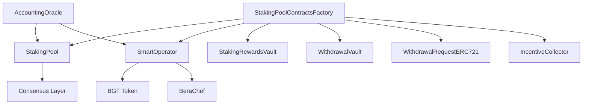

---
head:
  - - meta
    - property: og:title
      content: Berachain Staking Pools Overview
  - - meta
    - name: description
      content: Comprehensive overview of Berachain's validator staking pools system, architecture, and key concepts
  - - meta
    - property: og:description
      content: Comprehensive overview of Berachain's validator staking pools system, architecture, and key concepts
---

# Berachain Staking Pools Overview

Berachain Staking Pools provide a validator staking solution that allows users to stake BERA with validators while receiving stBERA tokens (validator staking shares) representing their position. This system enables automatic reward compounding, simplified staking, and decentralized validator operations.

This overview covers the core concepts and architecture. For specific implementation guides, see:

- [Staking Pools User Guide](./staking-pools-users.md) - How to stake, withdraw, and manage stBERA
- [Staking Pools Operator Guide](./staking-pools-operators.md) - How to setup and manage staking pools as a validator
- [Staking Pools Contracts](./staking-pools-contracts.md) - Technical reference for developers

## What Are Staking Pools?

Staking pools are smart contract-based systems that pool user deposits to validators while providing users with validator staking shares (stBERA). Unlike traditional staking where funds are locked, staking pools enable:

- **Validator Staking Shares**: Receive stBERA tokens representing your staked position with a specific validator
- **Automatic Compounding**: Rewards automatically increase your stBERA value
- **Simplified Withdrawals**: Exit your position through a structured withdrawal process
- **Simplified Management**: No need to manage validator operations directly

## Key Benefits

### For Users

- **Validator Staking Shares**: Receive stBERA tokens representing your stake with a specific validator
- **Auto-Compounding**: All rewards automatically compound without manual claiming
- **Lower Barriers**: Stake any amount without validator minimums
- **Professional Management**: Validators handle technical operations and BGT optimization

### For Validators

- **Capital Attraction**: Attract retail and institutional stakers
- **Revenue Diversification**: Earn commission fees on managed stake
- **Simplified Operations**: Automated BGT management and reward distribution
- **Risk Mitigation**: Shared responsibility for validator performance

### For the Ecosystem

- **Simplified Staking**: Lower barriers to participation in network security
- **Validator Decentralization**: Enables smaller validators to compete
- **Network Security**: Maintains validator incentives while improving accessibility

## Core Components

### stBERA Token

The validator staking share token that represents your stake in the pool:

- **Share-Based Accounting**: stBERA value increases as rewards accrue
- **Partial ERC20 Interface**: Implements balance queries but not transfers
- **Rebasing Mechanism**: Balance automatically reflects earned rewards
- **Non-Transferable**: Permanently disabled transfers by design (all transfer functions revert)

### Smart Contract Architecture



#### Factory Contract

Deploys and manages all staking pool components using beacon proxy pattern for upgradability.

#### Staking Pool

Core contract that:

- Manages user deposits and stBERA minting
- Handles deposits to consensus layer
- Processes withdrawal requests
- Calculates share-based rewards

#### Smart Operator

Manages validator operations including:

- BGT token boosting and unboosting
- Reward allocation management
- Commission settings
- Integration with Proof-of-Liquidity

#### Withdrawal System

Two-phase withdrawal process:

1. **Request**: Create withdrawal NFT with 256-epoch delay (~27 hours)
2. **Finalize**: Claim withdrawn BERA after delay period

#### Rewards Management

Automatic reward processing:

- **Execution Layer Rewards**: Auto-collected and compounded
- **BGT Rewards**: Automatically boost the validator
- **Incentive Tokens**: Auctioned for BERA via IncentiveCollector

## Validator Lifecycle

### 1. Pool Creation

1. Validator deploys staking pool contracts via factory
2. Registers validator with pool contracts as operator and withdrawal credentials via BeaconDeposit
3. Obtains cryptographic proofs from beacon API to verify correct setup
4. Activates pool by verifying setup with proofs

### 2. Active Operations

- Users deposit BERA and receive stBERA
- Pool automatically deposits to consensus layer when thresholds met
- BGT rewards automatically boost the validator
- Execution layer rewards auto-compound into pool value

### 3. Capacity Management

- **Minimum Effective Balance**: 250k BERA required to stay active
- **Maximum Capacity**: 10M BERA per validator
- **Automatic Pausing**: Pool pauses when full capacity reached

### 4. Exit Scenarios

- **Voluntary Exit**: Validator can trigger controlled shutdown
- **Automatic Exit**: Triggered when stake falls below minimum

## Economic Model

### Fee Structure

Validators can charge a commission on staker rewards (configurable percentage) with a maximum cap of 10% to protect stakers from excessive fees.

### Reward Distribution

1. **Block Rewards**: Split between validator commission and stakers
2. **BGT Rewards**: Used to boost validator for additional rewards
3. **Incentive Tokens**: Auctioned for BERA and distributed to stakers

### Share Price Mechanics

```
stBERA Price = Total Pool Assets / Total stBERA Supply

Where Total Pool Assets includes:
- Deposited BERA on consensus layer
- Buffered BERA in contract
- Accrued rewards in vault
- BGT token value
```

## Getting Started

### For Users

1. **Stake BERA**: Send BERA to staking pool to receive stBERA
2. **Use stBERA**: Utilize stBERA in DeFi protocols while earning rewards
3. **Request Withdrawal**: Create withdrawal NFT when wanting to exit
4. **Finalize Withdrawal**: Claim BERA after delay period

For detailed instructions on using staking pools, see the [Staking Pools User Guide](./staking-pools-users.md).

### For Validators

1. **Deploy Pool**: Use factory to deploy staking pool contracts
2. **Register Validator**: Call BeaconDeposit with pool contracts as operator and withdrawal credentials
3. **Obtain Proofs**: Get beacon proofs from API to verify setup
4. **Activate Pool**: Verify setup with proofs to enable user deposits

For comprehensive setup and management instructions, see the [Staking Pools Operator Guide](./staking-pools-operators.md).

### For Developers

1. **stBERA Integration**: Build protocols that read stBERA balances for governance or rewards (no transfers possible)
2. **MEV Opportunities**: Participate in incentive token auctions

For technical implementation details and contract interfaces, see the [Staking Pools Contracts Reference](./staking-pools-contracts.md).
