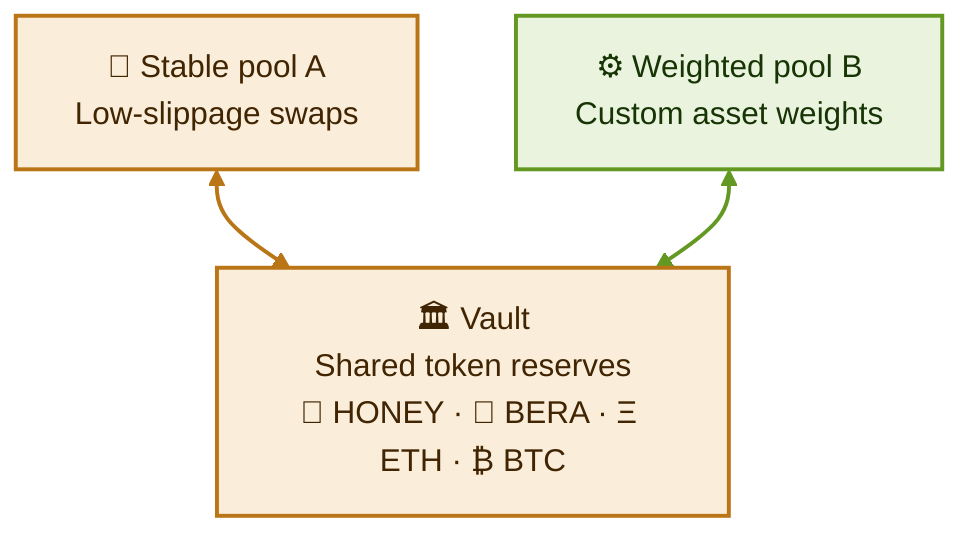

The Vault contract is a central component of BEX (not to be confused with Reward Vaults in Proof-of-Liquidity), acting as a unified smart contract that manages all tokens across liquidity pools. It serves as the primary interface for most protocol operations, including swaps, joins, and exits.

## Separating token accounting and pool logic

BEX's Vault and Pool architecture separates the token accounting and management from the pool logic and AMM math. The responsibility for calculating amounts for swaps, joins, and exits is delegated to the pool contracts, while the Vault holds all of the tokens within the various pools (which can even be of different types).

<Frame>
  
</Frame>

As a simplified example, a swap transaction involves the following steps:

<Steps>
  <Step title="Send swap request">
    You send a swap request to the Vault, specifying the pool ID to swap through and the amount to swap.
  </Step>
  <Step title="Look up pool contract">
    The Vault looks up the pool contract for the specified pool ID.
  </Step>
  <Step title="Calculate balance changes">
    The pool contract calculates the balance changes from the swap, returning those amounts to the Vault.
  </Step>
  <Step title="Update balances and transfer">
    The Vault updates the token balances based on the pool contract's calculations and sends the output tokens to you.
  </Step>
</Steps>

The Vault keeps pool balances strictly independent. This is critical for maintaining a permissionless system where tokens and pools can be created freely. Even though the Vault holds consolidated balances, the pool contracts are responsible for managing the balances within their pools. The depth of combined liquidity does not change the price impact of individual pools.

## Gas-efficient swaps

Storing all tokens in the same Vault contract provides greater gas efficiency. For example, in the case of a multi-hop swap (a trade routing through multiple pools), there is no need to transfer tokens at each step. Instead, the Vault keeps track of net balance changes and sends only what is needed at the end, saving on gas costs.
