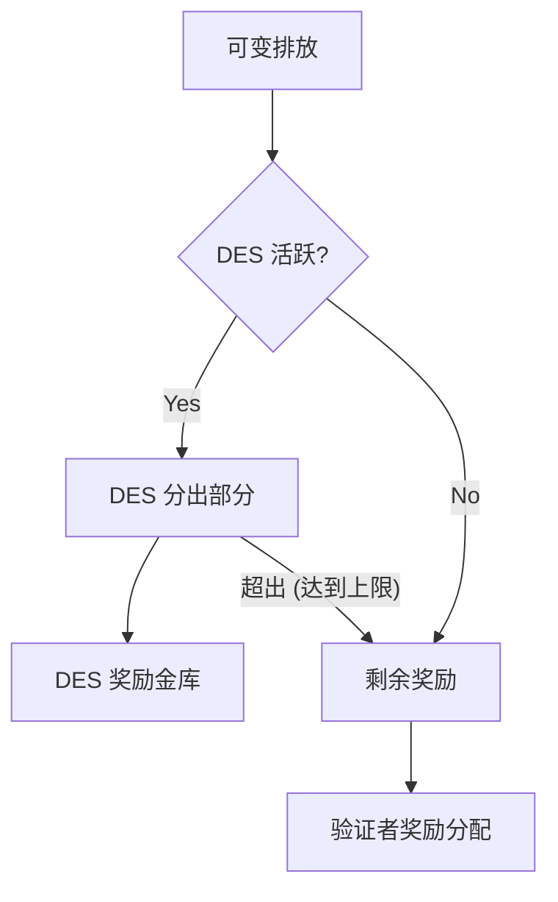

流动性证明使用 `$BGT` 代币管理 Berachain 的区块奖励与代币排放。本页说明验证者选择、区块奖励与排放计算的数学原理。

## 验证者选择

网络维持有资格参与区块生产的**69 名验证者**的活跃集。选择条件包括：

- 仅按 `$BERA` 质押量排序的**前 69 名验证者**进入活跃集
- 提议区块的概率与质押的 `$BERA` 成正比，不影响奖励金额
- 每验证者质押上下限：
  - 最低：250,000 `$BERA`
  - 最高：10,000,000 `$BERA`

某验证者被选中生产区块的概率等于其质押在活跃集总质押中的权重比例。

## $BGT 排放结构

当验证者生产区块时，`$BGT` 通过两个排放组成部分发放：

1. 基础排放
   - 等于 `base rate` 参数（B）的**固定数量**
   - 直接支付给生产区块的验证者

2. 奖励金库排放
   - 取决于验证者 boost（x）的**可变数量**
     - 即委托给该验证者的总 `$BGT` 占比
   - 分配给验证者选择的[奖励金库](/cn/general/proof-of-liquidity/reward-vaults)
     - 按验证者奖励分配中配置的权重比例
     - 验证者根据导向其奖励金库的数量从项目获得[激励](/cn/general/proof-of-liquidity/incentives)

## 验证者 Boost

Boost 是决定验证者奖励排放的关键指标：

- 计算为验证者被委托的 `$BGT` 占网络中委托的总 `$BGT` 的百分比
- 用 0 到 1 之间的小数表示
- 例：若验证者被委托 1000 `$BGT` 而网络总委托为 10000 `$BGT`，则其 boost 为 0.1（10%）。Boost 越高，奖励排放越高（受排放公式约束）

## BeraChef：奖励分配管理

BeraChef 是管理验证者如何将 BGT 奖励导向不同奖励金库的核心合约，作为根据验证者偏好决定奖励分配的配置层。

### 核心职责

BeraChef 管理奖励系统的三个关键方面：

1. **奖励分配** — 维护决定分配给各奖励金库比例的权重列表
2. **验证者佣金** — 管理验证者对激励代币收取的佣金比例
3. **金库白名单** — 控制哪些金库有资格接收 BGT 奖励

### 奖励分配如何运作

每位验证者可设置自定义奖励分配，指定其 BGT 奖励应如何分配。

奖励分配由以下描述：

1. 所选金库列表及发送给每个金库的该区块 BGT 奖励比例。权重之和须为 100。
2. 分配生效的区块号。

验证者在 450 个区块的延迟条件下对 BeraChef 奖励分配进行控制。

**若验证者在 302,400 个区块（约 7 天）内未更新其 cutting board**，BeraChef 将开始应用 _baseline_ cutting board。该 _baseline_ 分配旨在将排放高效导向有活跃激励的奖励金库。

### 佣金管理

BeraChef 在下列约束下管理验证者激励代币佣金比例：

- **默认佣金**：未显式设置时为 5%
- **最高佣金**：合约强制 20% 硬顶
- **变更延迟**：佣金变更生效前须经过的等待期

## 每区块 $BGT 排放

每区块发放的 `$BGT` 总量由以下公式计算：

$$emission = \left[B + \max\left(m, (a + 1)\left(1 - \frac{1}{1 + ax^b}\right)R\right)\right]$$

### 参数

| 参数                       | 描述                                                    | 影响                                         |
| -------------------------- | ------------------------------------------------------- | -------------------------------------------- |
| x (boost)                  | 委托给验证者的总 `$BGT` 占比（范围：[0,1]）             | 决定流向奖励金库的 `$BGT` 排放               |
| B (base rate)              | 区块生产的基础 `$BGT` 固定量                            | 决定验证者基础奖励                           |
| R (reward rate)            | 奖励金库的基础 `$BGT` 数量                              | 设定奖励排放基础                             |
| a (boost multiplier)       | Boost 影响系数                                         | 值越大 boost 越重要                          |
| b (convexity parameter)    | Boost 影响曲线陡峭度                                   | 值越大对低 boost 惩罚越重                    |
| m (minimum boosted reward rate) | 奖励金库排放下限                                 | 值越大对低 boost 验证者越有利                |

此公式描述一个区块的总可变排放量。若 [Dedicated emission stream](#dedicated-emission-stream) 处于活跃状态，其中一部分将先分配给 DES 金库，其余部分再进入验证者的奖励分配。

### 示例排放图

使用下列示例参数，下图展示排放如何随 `$BGT` 委托变化：

$$B = 0.4, R = 1.1, a = 3.5, b = 0.4, m = 0$$

<Frame>
  
</Frame>

## 最大区块通胀

`$BGT` 排放随验证者 boost 增加而增加，直至上限。100% boost 时达到最大理论区块排放：

$$\max \mathbb{E}[\text{emission}] = \left[B + \max(m, aR)\right]$$

## Dedicated emission stream

在验证者自身的奖励分配之前，Distributor 可能会从可变排放中分出一部分，定向到治理指定的奖励金库。该机制称为 **Dedicated Emission Stream (DES)**。

`DedicatedEmissionStreamManager` 合约控制三个参数，均由治理设置：

- **`emissionPerc`** — 每区块可变奖励中被分出的百分比，以 basis points 表示，满值为 10,000。500 表示 5%。
- **`targetEmission`** — 每个金库的累计上限。当金库收到的 DES 排放达到目标量时，将停止接收后续分配。超出部分返回该区块验证者自身的奖励分配。
- **奖励分配权重** — 白名单奖励金库列表及各金库在分出部分中的份额，使用与 BeraChef 相同的权重格式（百分比之和须为 100%）。

### 对验证者的影响

DES 分出部分减少了验证者可支配的有效可变奖励。若 `emissionPerc` 设为 5%，则产出区块的验证者获得可变排放的 95% 用于按其 BeraChef 奖励分配进行分发。基础排放（直接支付给验证者 operator）不受影响。

当前 DES 参数（包括分出百分比、目标金库和每金库上限）可从链上 [`DedicatedEmissionStreamManager`](/build/getting-started/deployed-contracts) 合约读取。

## $BGT 分配

Distributor 按区块向奖励金库发放 `$BGT`。网络在下一区块处理该区块的分配，从而产生奖励金库质押者可领取的 `$BGT`。

网络按区块生成奖励，但在**三天内**线性分配。存入者按其存入比例在这段时间内线性获得奖励。每次有新奖励到达时奖励窗口会重置。

### 分配示例

在 Berachain 上，`$BGT` 按区块分配，即三天分配期会不断被“推”到从当前区块“开始”。因此应将其视为基于过去三天任意时刻排放的滑动窗口。

用简化数字的示例：

- 每天分配 3 `$BGT`，9 天共 27
- 1 名存入者，拥有全部存入

<Frame>
  
</Frame>

**图例**

- Emitted：已分配且可用的 `$BGT` 总数
- Claimable：存入者可领取的 `$BGT` 总数
- Daily Reward：根据已发放代币解锁记为可领取的每日 `$BGT` 数

结果是存入者在三天后奖励达到饱和点之前，每天收到的 `$BGT` 递增；之后所有奖励都在持续分配。

奖励期限通过该分配机制激励存入者与生态一致，而不是允许奖励被立即领取。

## 计算 Boost APR

Boost APR 在 [Berachain Hub](https://hub.berachain.com) 各处展示。

<Frame>
  
</Frame>

Boost APR % 使用由起始区块与结束区块定义的区块范围计算。在计算百分比时，APR 计算器对所有代币价格（以 $BERA 计）进行采样。
