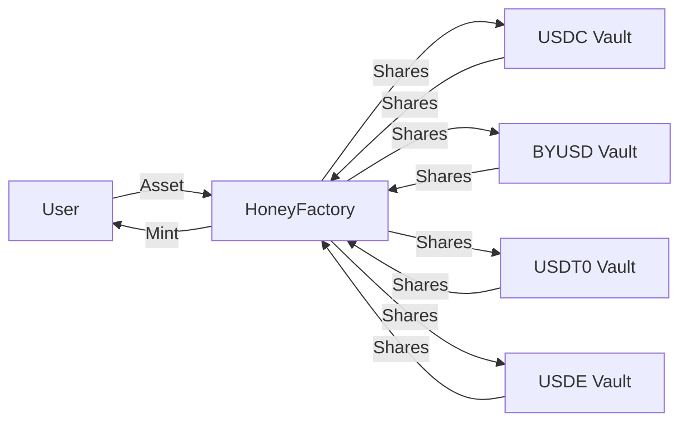

`$HONEY` 软锚定美元、完全抵押，是 Berachain 的原生稳定币，为生态内外提供稳定的交换手段。

## 使用与铸造 $HONEY

`$HONEY` 与其他稳定币角色相同——支付、汇款、对冲波动——并在 Berachain DeFi 中广泛用作基础交易对和借贷资产。通过 [HoneySwap](https://honey.berachain.com) 可用抵押品铸造和赎回 `$HONEY`，也可在 BEX 或其他交易所兑换获得。

生命周期很简单：存入白名单抵押资产铸造 `$HONEY`，自由使用，完成后赎回抵押品。每种抵押资产的铸造和赎回率由 `$BGT` 治理配置。

### 抵押资产

以下资产可作为抵押品铸造 `$HONEY`：

- `$USDC`
- `$BYUSD`（`$pyUSD`）
- `$USDT0`
- `$USDE`

新抵押资产可通过治理添加。

## $HONEY 架构

`$HONEY` 铸造流程及相关合约的流程图如下：

### $HONEY 金库

`$HONEY` 通过将符合条件的抵押品存入专用金库合约铸造。每个金库对应一种抵押品类型。每种抵押品的铸造和赎回率独立配置——当前值参见[费用](#费用)。

### 抵押品托管

治理可以通过设置托管人地址将某个金库指定为托管金库。启用托管后，存入的抵押品会自动从金库合约转发给托管人。赎回时，抵押品先从托管人处取回，再返还给用户。金库的份额记账不受影响——无论底层资产存放在何处，抵押品与金库份额之间的 1:1 兑换率保持不变。

治理可以取消托管，此时所有抵押品从托管人转回金库合约。

### HoneyFactory

`$HONEY` 铸造流程的核心是 [`HoneyFactory`](https://berascan.com/address/0xA4aFef880F5cE1f63c9fb48F661E27F8B4216401) 合约（主网和 Bepolia 地址相同）。该合约作为中心枢纽，连接所有 `$HONEY` 金库并负责铸造新 `$HONEY` 代币。

如图所示，您的存入经 HoneyFactory 合约路由到对应金库。HoneyFactory 托管金库铸造的份额（对应您的存入），并向您铸造 `$HONEY` 代币。

## 脱锚与篮子模式

篮子模式是当抵押资产变得不稳定时触发的安全机制。它以特定方式影响 `$HONEY` 的铸造与赎回：

**赎回：**

- 当**任意**抵押资产脱锚时，篮子模式自动激活
- 在此模式下，您不能选择用哪种资产赎回 `$HONEY`
- 您将按篮子中**所有**抵押资产的占比获得相应组合
- 例如，若在篮子模式激活时赎回 1 `$HONEY`，您将根据各抵押资产的相对占比获得每种资产的一部分

**铸造：**

- 铸造的篮子模式被视为边缘情况，仅当**所有**抵押资产均脱锚或被列入黑名单时发生。脱锚资产不能用于铸造 `$HONEY`
- 在此情况下，要铸造 `$HONEY`，您必须提供篮子中所有抵押资产的按比例组合，而不能只选一种资产
- 若一种资产脱锚，您只能用其他资产铸造

## 费用

`$BGT` 持有者获得铸造与赎回 `$HONEY` 收取的手续费。当前费用结构如下：

| 稳定币 | 铸造费 | 赎回费 |
| ------ | ------ | ------ |
| USDT   | 0.1%   | 0%     |
| byUSD  | 0.1%   | 0%     |
| USDC   | 0%     | 0.05%  |
| USDe   | 0%     | 0.05%  |

### 示例

以 `$USDC` 铸造与赎回 `$HONEY` 为例：

**铸造：**

- 用户存入 `1,000 $USDC`
- 收到 `1,000 $HONEY`（0% 费）
- 不收取费用

**赎回：**

- 用户将 `1,000 $HONEY` 赎回为 `$USDC`
- 收到 `999.5 $USDC`（0.05% 费 = 0.5 $USDC）
- `0.5 $USDC` 手续费分配给 `$BGT` 持有者

## 无 Gas 转账与授权

`$HONEY` 支持两项 ERC-20 扩展，允许由第三方代表代币持有者提交交易，持有者无需支付 Gas：

- **EIP-2612 `permit`** — 持有者签署链下消息以授权支出额度。中继者或合约随后可在链上提交该 permit，持有者无需发送交易。该接口与 USDC、DAI 及大多数现代 ERC-20 代币所用相同。
- **EIP-3009 `transferWithAuthorization` / `receiveWithAuthorization`** — 持有者签署链下消息以授权一次性转账给指定接收者。接收者（或中继者）在链上提交。每笔授权包含唯一 nonce 以防止重放。

两项扩展均使用 [EIP-712](https://eips.ethereum.org/EIPS/eip-712) 类型化结构数据签名。
