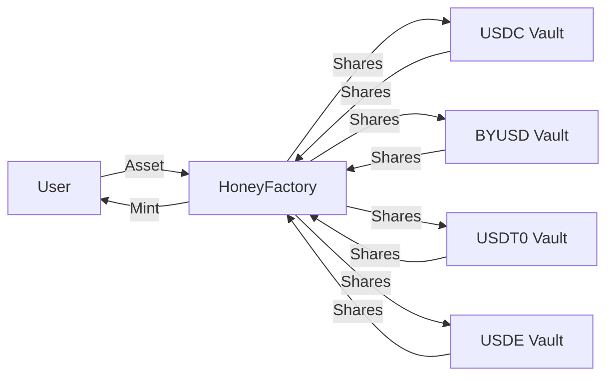

`$HONEY` 是 Berachain 的原生稳定币，旨在在 Berachain 生态内外提供稳定、可靠的交换手段。`$HONEY` 完全抵押、软锚定美元。

## 如何获取 $HONEY

`$HONEY` 可通过将已白名单抵押品存入金库，并通过 [HoneySwap dApp](https://honey.berachain.com) 以该抵押品铸造 `$HONEY` 获得。每种抵押资产的 `$HONEY` 铸造率可由 `$BGT` 治理配置。

您也可以在 BEX 或其他去中心化交易所用其他资产兑换 `$HONEY`。

### 抵押资产

以下资产可作为抵押品铸造 `$HONEY`：

- `$USDC`
- `$BYUSD`（`$pyUSD`）
- `$USDT0`
- `$USDE`

用于铸造 `$HONEY` 的新资产可通过治理添加。

## $HONEY 的用途？

`$HONEY` 的用途与其他稳定币相同，如支付/汇款和对冲市场波动。`$HONEY` 也可在 Berachain DeFi 生态内使用。

## $HONEY 架构

`$HONEY` 铸造流程及相关合约的流程图如下：

### $HONEY 金库

`$HONEY` 通过将符合条件的抵押品存入专用金库合约铸造。每个金库对应一种抵押品类型。目前所有金库使用相同转换率：100% 铸造率（0% 铸造费）和 99.95% 赎回率（0.05% 赎回费）。

### HoneyFactory

`$HONEY` 铸造流程的核心是 HoneyFactory 合约。该合约作为中心枢纽，连接所有 `$HONEY` 金库并负责铸造新 `$HONEY` 代币。

如图所示，您的存入经 HoneyFactory 合约路由到对应金库。HoneyFactory 托管金库铸造的份额（对应您的存入），并向您铸造 `$HONEY` 代币。

## 脱锚与篮子模式

篮子模式是当抵押资产变得不稳定时触发的安全机制。它以特定方式影响 `$HONEY` 的铸造与赎回：

**赎回：**

- 当**任意**抵押资产脱锚时，篮子模式自动激活
- 在此模式下，您不能选择用哪种资产赎回 `$HONEY`
- 您将按篮子中**所有**抵押资产的占比获得相应组合
- 例如，若在篮子模式激活时赎回 1 `$HONEY`，您将根据各抵押资产的相对占比获得每种资产的一部分

**铸造：**

- 铸造的篮子模式被视为边缘情况，仅当**所有**抵押资产均脱锚或被列入黑名单时发生。脱锚资产不能用于铸造 `$HONEY`
- 在此情况下，要铸造 `$HONEY`，您必须提供篮子中所有抵押资产的按比例组合，而不能只选一种资产
- 若一种资产脱锚，您只能用其他资产铸造

## 费用

`$BGT` 持有者获得铸造与赎回 `$HONEY` 收取的手续费。当前费用结构如下：

| 稳定币 | 铸造费 | 赎回费 |
| ------ | ------ | ------ |
| USDT   | 0.1%   | 0%     |
| byUSD  | 0.1%   | 0%     |
| USDC   | 0%     | 0.05%  |
| USDe   | 0%     | 0.05%  |

### 示例

以 `$USDC` 铸造与赎回 `$HONEY` 为例：

**铸造：**

- 用户存入 `1,000 $USDC`
- 收到 `1,000 $HONEY`（0% 费）
- 不收取费用

**赎回：**

- 用户将 `1,000 $HONEY` 赎回为 `$USDC`
- 收到 `999.5 $USDC`（0.05% 费 = 0.5 $USDC）
- `0.5 $USDC` 手续费分配给 `$BGT` 持有者
