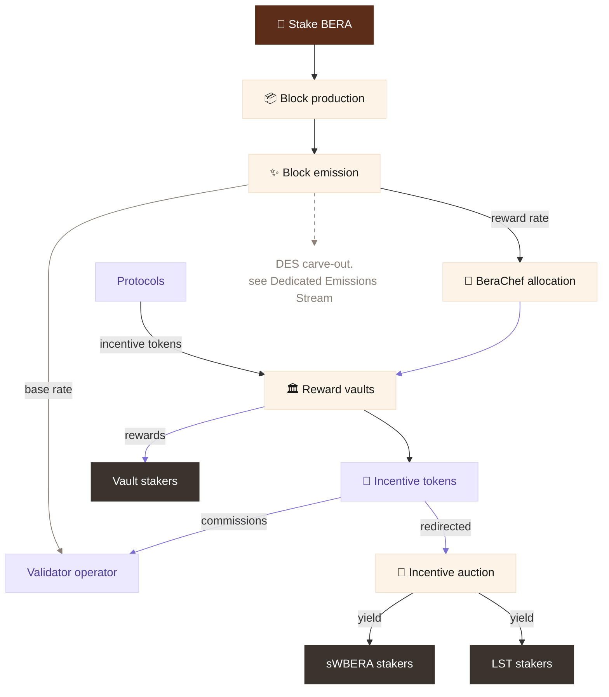

Proof of Liquidity (PoL) is Berachain’s answer to the emissions problem. Most chains spend emissions like a faucet: tokens flow out to secure the network, subsidise activity, and attract applications, but little value flows back.

Berachain flips this model with Proof of Liquidity. Instead of treating emissions as a pure cost, PoL turns them into growth capital for applications building on the chain. Emissions are directed toward useful liquidity, application activity, and businesses that can generate value back into the ecosystem.

The loop is simple: emissions to businesses → businesses grow and earn more → revenue is shared with the chain directly or through the incentive market → \$BERA strengthen → more businesses funded with emissions → repeat.

_The PoL value cycle: emissions fund businesses, businesses return revenue, revenue strengthens BERA, and a stronger BERA economy underwrites the next emissions._

## How PoL works

PoL starts when validators stake \$BERA to secure the chain and produce blocks. When blocks are produced, the network emits \$WBERA.

A portion of those emissions goes to validator operators. The rest flows through Berachain’s reward allocation system and is directed toward Reward Vaults, where applications connect useful liquidity and activity to network incentives.

Applications can fund incentives to attract emissions. Users can earn rewards by providing liquidity or activity through eligible vaults, or by participating through simpler staking paths such as \$sWBERA.

Incentives earned through the system are converted into \$BERA and accrued into \$sWBERA, creating a cleaner value path for users and keeping rewards aligned with the broader \$BERA economy.

This creates a market for useful activity. Validators compete for stake, applications compete for emissions, and users choose where to supply liquidity or participate in staking.

In addition to market-based allocation, selected businesses can receive [**Dedicated Emission Streams**](/general/proof-of-liquidity/dedicated-emission-stream): predictable emissions they can plan around and use for long-term growth. These businesses use emissions to grow, then return value to Berachain through premium repayments and long-term revenue sharing.

For a comprehensive breakdown of all PoL components, roles, and pathways, continue to [Proof of Liquidity Overview](/general/proof-of-liquidity/overview). If you’re building on Berachain, start your integration journey with [Integration Basics](/build/pol/integration-basics).
