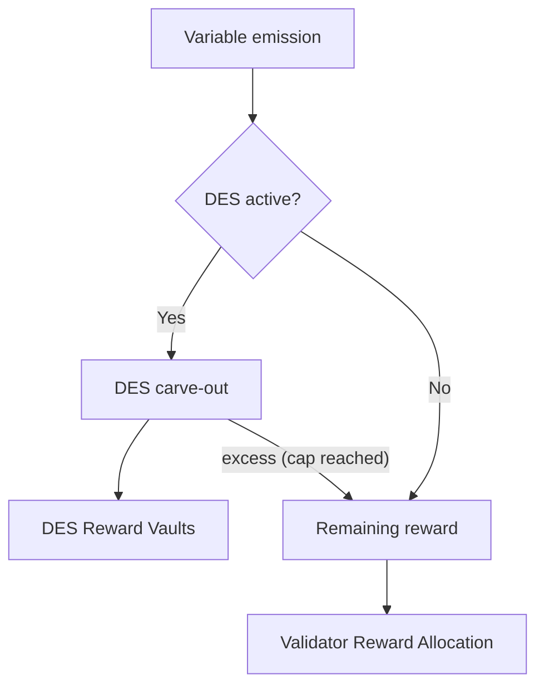

Proof-of-Liquidity governs block rewards and token emissions on Berachain using the `$BGT` token. This page explains the mathematical principles behind validator selection, block rewards, and emissions calculations.

## Validator selection

The network maintains an active set of **69 validators** who are eligible for block production. Selection criteria include:

- Only top **69 validators** by `$BERA` stake are included in active set
- Block proposal probability is proportional to staked `$BERA` and does not affect reward amounts
- Stake limitations per validator:
  - Minimum: 250,000 `$BERA`
  - Maximum: 10,000,000 `$BERA`

A given Validator's probability of being selected to produce a block is the proportion of its stake's weight to the total stakes of the active set.

## $BGT emissions structure

When a validator produces a block, `$BGT` tokens are emitted through two emission components:

1. Base Emission
   - **Fixed amount** equal to a `base rate` parameter (B)
   - Paid directly to block-producing validator

2. Reward Vault Emission
   - **Variable amount** dependent on validator's boost (x)
     - i.e. percentage of total `$BGT` delegated to the validator
   - Distributed to [Reward Vaults](/general/proof-of-liquidity/reward-vaults) selected by validator
     - Proportional to weights configured in the validator's Reward Allocation
     - Validators receive [Incentives](/general/proof-of-liquidity/incentives) from projects based on amounts directed to their Reward Vaults

## Validator boosts

Boost is a crucial metric that determines a validator's reward emissions:

- Calculated as the percentage of `$BGT` delegation a validator has compared to the total `$BGT` delegated in the network
- Expressed as a decimal between 0 and 1
- Example: If a validator has 1000 `$BGT` delegated and the network has 10000 total `$BGT` delegated, their boost would be 0.1 (10%). Higher boost leads to higher reward emissions, subject to the emission formula.

## BeraChef: Reward allocation management

BeraChef is the core contract that manages how validators direct their BGT rewards across different Reward Vaults. It serves as the configuration layer that determines reward distribution based on validator preferences.

### Core responsibilities

BeraChef manages three key aspects of the reward system:

1. **Reward Allocations** - Maintains lists of weights that determine the percentage of rewards going to each Reward Vault
2. **Validator Commission** - Manages commission rates that validators can charge on incentive tokens
3. **Vault Whitelisting** - Controls which vaults are eligible to receive BGT rewards

### How reward allocations work

Each validator can set a custom reward allocation that specifies how their BGT rewards should be distributed.

Reward Allocations are described by:

1. A list of selected vaults and the percentage of a given block's BGT reward to send to each. The weights must sum to 100.
2. The block number the allocation becomes effective.

Validators exercise control over the BeraChef reward allocation subject to a delay of 450 blocks.

**If a validator doesn't update its cutting board within 302,400 blocks (approximately 7 days),** BeraChef will begin to apply the _baseline_ cutting board. This _baseline_ allocation is chosen to direct emissions efficiently to reward vaults with active incentives.

### Commission management

BeraChef manages validator commission rates on incentive tokens with the following constraints:

- **Default Commission**: 5% if not explicitly set
- **Maximum Commission**: 20% hard cap enforced by the contract
- **Change Delay**: Required waiting period before commission changes take effect

## $BGT emissions per block

The total `$BGT` emitted per block is calculated using the following formula:

$$emission = \left[B + \max\left(m, (a + 1)\left(1 - \frac{1}{1 + ax^b}\right)R\right)\right]$$

### Parameters

| Parameter                       | Description                                                    | Impact                                         |
| ------------------------------- | -------------------------------------------------------------- | ---------------------------------------------- |
| x (boost)                       | Fraction of total `$BGT` delegated to validator (range: [0,1]) | Determines `$BGT` emissions to Reward Vaults   |
| B (base rate)                   | Fixed amount of `$BGT` for block production                    | Determines baseline validator rewards          |
| R (reward rate)                 | Base `$BGT` amount for reward vaults                           | Sets foundation for reward emissions           |
| a (boost multiplier)            | Boost impact coefficient                                       | Higher values increase boost importance        |
| b (convexity parameter)         | Boost impact curve steepness                                   | Higher values penalize low boost more severely |
| m (minimum boosted reward rate) | Floor for reward vault emissions                               | Higher values benefit low-boost validators     |

This formula describes the total variable emission for a block. If the [Dedicated emission stream](#dedicated-emission-stream) is active, a fraction is directed to DES vaults before the remainder reaches the validator's reward allocation.

### Sample emissions chart

Using the current on-chain parameters (as of February 2026), the chart below shows how emissions scale with `$BGT` delegation:

$$B = 0.4, R = 0.65, a = 3.5, b = 0.4, m = 0$$

<Frame>
  
</Frame>

## Max block inflation

`$BGT` emissions grow with the amount of boost a validator has, up to a cap. The maximum theoretical block emission occurs at 100% boost:

$$\max \mathbb{E}[\text{emission}] = \left[B + \max(m, aR)\right]$$

## Dedicated emission stream

Before the validator's own reward allocation is applied, the Distributor may carve out a fraction of the variable emission and direct it to a governance-designated set of reward vaults. This mechanism is called the **Dedicated Emission Stream (DES)**.

The `DedicatedEmissionStreamManager` contract controls three parameters, all set by governance:

- **`emissionPerc`** — the percentage of each block's variable reward that is carved out, expressed in basis points out of 10,000. A value of 500 means 5%.
- **`targetEmission`** — a per-vault cumulative cap. Once a vault has received its target amount of DES emissions, it stops receiving further distributions. Any excess is returned to the validator's own reward allocation for that block.
- **Reward allocation weights** — a list of whitelisted reward vaults and the share each receives within the carve-out, following the same weight format used by BeraChef (percentages must sum to 100%).

### Impact on validators

The DES carve-out reduces the effective variable reward available for validator-directed allocation. If `emissionPerc` is set to 5%, a validator producing a block receives 95% of the variable emission to distribute according to its BeraChef reward allocation. The base emission (paid directly to the validator's operator) is unaffected.

The current DES parameters — including the carve-out percentage, target vaults, and per-vault caps — can be read from the [`DedicatedEmissionStreamManager`](/build/getting-started/deployed-contracts) contract on-chain.

## $BGT distribution

The Distributor emits `$BGT` to reward vaults on a per-block basis. The network processes distributions for a given block during the following block. This creates `$BGT` that Reward Vault stakers can then claim.

The network creates rewards on a per-block basis; however, it distributes them **over a three-day period.** Depositors receive rewards streamed linearly over this period, proportionally to their deposit amounts. The reward window resets each time new rewards arrive.

### Distribution example

On Berachain, `$BGT` is distributed per block, meaning that the three-day distribution period is consistently being pushed to "start" on the current block. Thus, this period should be viewed as a sliding window based on the emissions at any given time during the previous three days.

A more real-world example with simplified numbers:

- 3 `$BGT` distributed daily, for a total of 27 over 9 days
- 1 depositor, owning all the deposits

<Frame>
  
</Frame>

**Legend**

- Emitted: Total number of `$BGT` distributed and available
- Claimable: Total number of `$BGT` able to be claimed by depositors
- Daily Reward: Daily number of `$BGT` marked as claimable based on emitted tokens unlocks

This results in the depositor receiving an increasing amount of `$BGT` daily until rewards reach a saturation point after three days where all rewards are actively being distributed.

Reward duration periods incentivize ecosystem alignment with depositors via this distribution mechanism rather than allowing rewards to be instantly claimed.

## Calculating boost APR

Boost APR is shown throughout the [Berachain Hub](https://hub.berachain.com).

<Frame>
  
</Frame>

Boost APR % is calculated using ranges of blocks, defined by a starting block and an ending block. At the time the percentages are calculated, the APR calculator samples the prices of all tokens (in $BERA).
