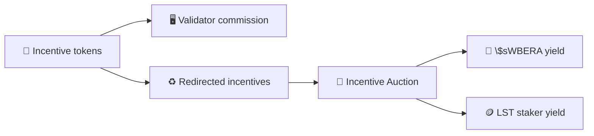

Proof of Liquidity lets businesses and protocols bid for validator reward allocation by attaching incentive tokens to whitelisted Reward Vaults. Validators allocate \$WBERA emissions to those vaults and earn incentive commission when their allocation captures funded incentives.

This page covers the market-based path for routing emissions through validator allocation. Dedicated Emission Streams are a separate routing path for selected businesses that receive predictable emissions outside the standard validator-allocation market.

## How incentives work

1. Validators stake \$BERA to enter the active set; the more BERA staked, the greater probability to produce a block
2. When validators produce blocks, BeraChef applies their reward allocation to route \$WBERA to whitelisted vaults.
3. Businesses and protocols fund Reward Vault incentives to attract validator allocation..
4. Incentives split into two paths: validator commission and incentives redirected to \$sWBERA. Validator commission is paid to the validator operator. Redirected incentives are settled through the Incentive Auction, converted into \$BERA / \$WBERA yield, and accrued into \$sWBERA.

## Incentive distribution roles

| Participant     | Role                                                                      |
| --------------- | ------------------------------------------------------------------------- |
| Protocol        | Funds incentive tokens to attract validator reward allocation.            |
| Validator       | Allocates Reward Vault emission and earns commission on incentive tokens. |
| BERA staker     | Stakes \$BERA with validators, increasing block-production probability.   |
| \$sWBERA staker | Earns WBERA yield from the Incentive Auction through \$sWBERA.            |
| LST staker      | Earns WBERA yield when their LST has a registered staker vault.           |
| Vault staker    | Stakes receipt tokens and earns allocated WBERA emissions from the vault. |

## Incentive token lifecycle

### Whitelisting

Reward Vaults can whitelist up to two incentive tokens through governance.

### Token managers

Each whitelisted incentive token has a token manager that funds incentives and manages rates under governance constraints.

### Incentive rate

Incentives use an exchange rate per unit of allocated emission:

`incentiveTokens = emissionAllocatedToVault * incentiveRate`

Rates can increase when the token manager deposits more inventory. Decreasing rates is restricted until existing inventory is exhausted.

## Commission and payouts

Validator commission is capped at **20%**. Reward Vault incentive processing sends the validator commission to the validator operator and sends the remaining incentive tokens to `BGTIncentiveFeeCollector`.

## Incentive fee settlement

The redirected incentive share collects in `BGTIncentiveFeeCollector`, the shared settlement path for Reward Vault incentives. Incentive tokens accumulate in the collector,
and WBERA paid into settlement becomes yield for \$sWBERA stakers and registered LST stakers.

See [Deployed contract addresses](/build/getting-started/deployed-contracts) for the current **BGTIncentiveFeeCollector** address.

### Settlement behavior

Settlement is a fixed-price exchange against the collector: a buyer pays WBERA into the incentive collector, receives the selected incentive tokens held by the collector, and the paid WBERA is split **pro-rata** (by WBERA-denominated total assets) between the \$sWBERA staking vault and registered `LSTStakerVault`s. Registered LST vaults receive yield through their LST adapter (`receiveRewards`).

**LST integration:** issuers deploy an `LSTStakerVault` system via [`LSTStakerVaultFactory`](/build/getting-started/deployed-contracts), then register the vault and adapter on the collector's LST registry to join the auction split. See [LST Integration](/build/pol/lst-integration) for the full integrator workflow.

## Incentive redirection

After validator commission, redirected incentives move through the auction path:

- **Validator commission**: paid directly to the validator operator.
- **Incentive Auction**: redirected incentive tokens are settled for \$WBERA.
- **Yield receivers**: auction WBERA becomes yield for \$sWBERA stakers and registered LST stakers.

See [\$sWBERA Token](/general/tokens/swbera) for the staking-vault side of this flow.
