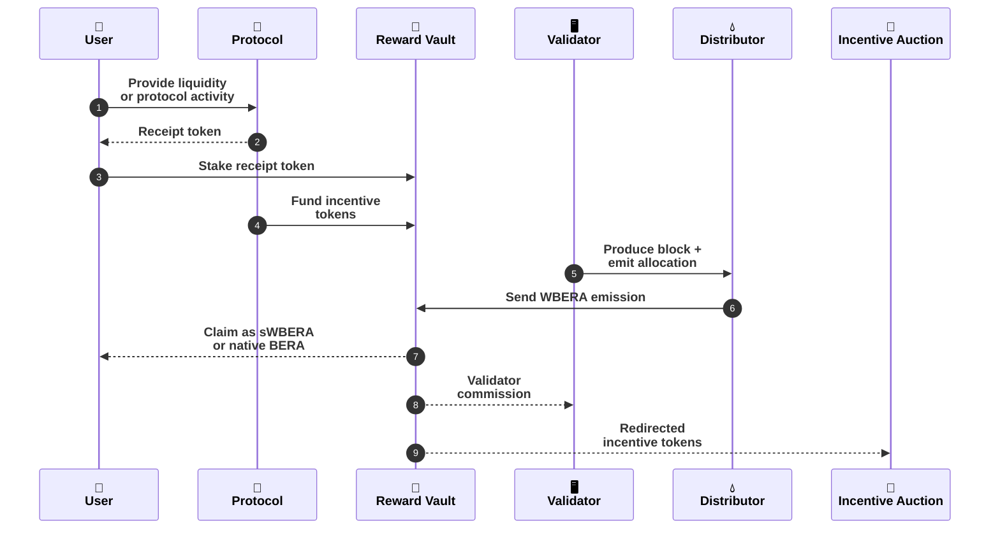
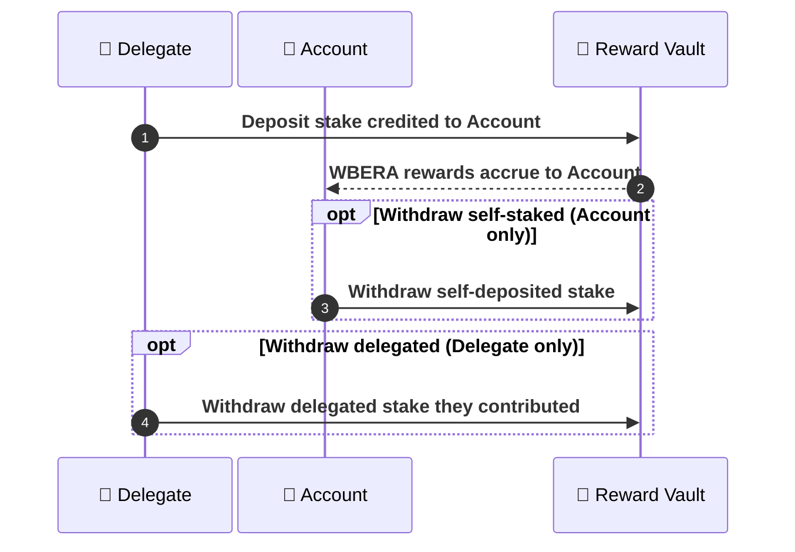

Reward Vaults are the PoL contracts where users stake eligible receipt tokens and earn allocated \$WBERA rewards. Reward Vaults can receive emissions through validator allocation and, where applicable, Dedicated Emission Streams. Businesses and protocols attach incentive tokens to Reward Vaults to attract validator allocation. When a Reward Vault with active incentives receives emissions, those incentives are split between validator commission and the remaining incentives, which are converted through the Incentive Auction and accrued into \$sWBERA.

Reward Vaults are key infrastructure for businesses and protocols to access PoL. A business or protocol can operate multiple vaults, each with its own PoL-eligible receipt asset — for example, separate BEX pools can each have their own Reward Vault.

<Info>
Only governance-whitelisted Reward Vaults can receive PoL emissions. Depending on the route, emissions may be allocated through validator reward allocation or through Dedicated Emission Streams.

See [Reward Vault Requirements and Guidelines](/general/help/reward-vault-guidelines) for whitelisting requirements.

For staking on behalf of another address, see [Delegation](#delegation).

</Info>

## Staking with a reward vault

To earn allocated \$WBERA from a Reward Vault, a user stakes the PoL-eligible asset in that vault. The protocol that deployed the vault decides how users obtain the receipt token to stake—typically by providing liquidity.

1. The user takes an action that yields a PoL-eligible receipt token.
2. The user stakes that token in the corresponding Reward Vault.
3. The user earns a pro-rata share of \$WBERA streamed to the vault, based on [emission timing](#wbera-emission-timing-modes) and vault rules.

The \$WBERA amount a user earns from a Reward Vault depends on:

1. The user’s share of total assets staked in the vault.
2. The \$WBERA emission rate and timing for that vault (see [block rewards](/general/proof-of-liquidity/block-rewards) and [emission modes](#wbera-emission-timing-modes) below).

After staking, users can claim rewards, add to their deposit, or withdraw subject to the vault’s rules. Vault staking is designed to feel like familiar DeFi staking flows.

Reward Vault emissions pay **\$WBERA**.

<Note>
  The [RewardVaultHelper](/build/pol/reward-vault-helper-claim-flow) is an optional UX component
  that converts \$WBERA claims atomically into \$sWBERA or native \$BERA. Direct vault claims still
  pay \$WBERA.
</Note>



At the protocol level (numbered to match the diagram above):

1. The user provides liquidity to the protocol or performs another PoL-eligible action.
2. The protocol issues the user a PoL-eligible receipt token.
3. The user stakes the receipt token in the corresponding Reward Vault.
4. The protocol funds the Reward Vault with incentive tokens to attract validator allocation.
5. An active validator produces a block and the Distributor receives the per-block emission.
6. The Distributor sends the \$WBERA Reward Vault emission to the vault.
7. The user claims rewards as \$sWBERA or native \$BERA through [RewardVaultHelper](/build/pol/reward-vault-helper-claim-flow).
8. The Reward Vault pays validator commission out of the funded incentive tokens.
9. The Reward Vault redirects the remaining incentive tokens to the [Incentive Auction](/general/proof-of-liquidity/incentives#incentive-fee-settlement), where they are converted into \$BERA / \$WBERA yield and accrued into \$sWBERA.

After staking, users can claim rewards, add stake, or withdraw based on vault rules.

## Staking on behalf of another address

The RewardVault supports **delegation**: one address (the **delegate**) can stake on behalf of another (the **account**). Common patterns include:

- **Custodial staking**: exchanges or custodians staking on behalf of users.
- **Smart contract integration**: protocols that stake user funds automatically.
- **Managed staking services**: third parties operating staking on behalf of accounts.



**Key delegation concepts**

- **Delegate**: address that deposits and withdraws delegated stake (`msg.sender` for those actions).
- **Account**: address that owns the position and receives rewards.
- **Self-staked balance**: stake deposited directly by the account.
- **Delegated balance**: stake deposited by delegates for that account.

Only the account can withdraw self-staked balance. Delegates can withdraw only delegated stake they contributed.

## WBERA emission timing modes

Reward Vaults operate in one of two mutually exclusive modes for **WBERA reward distribution timing** (streamed rewards).

### Duration-based mode

In this mode, the `rewardDurationManager` sets a fixed `rewardsDuration` (typically 3–7 days). Each time \$WBERA rewards are added to the vault via `notifyRewardAmount`, the \$WBERA is distributed evenly over that period.

Duration-based mode enforces the 3–7 day range: if you switch from target-rate mode where the computed duration exceeded 7 days, the duration is capped at 7 days.

**Example:** If 100 \$WBERA is added with a 5-day duration, the vault distributes 20 \$WBERA per day to stakers.

### Target rate mode

When `targetRewardsPerSecond` is set to a non-zero value, the vault computes the distribution period for each \$WBERA deposit. The vault keeps the effective emission rate from exceeding the target while respecting the minimum duration limit.

```text
period = max(minRewardDurationForTargetRate, totalReward / targetRate)
```

The duration is never shorter than the minimum (default 3 days), but can extend beyond 7 days if needed to maintain the target rate.

### Switching between modes

The Reward Vault manager can switch between modes:

- Set a positive target rate to keep WBERA streaming at that rate.
- Set the target rate to zero to return to duration-based distribution.

## Incentive management

Reward Vaults support **incentive tokens**: additional tokens protocols attach so validators have a reason to allocate \$WBERA emissions toward the vault.

### How incentive tokens work

1. **Whitelisting**: incentive tokens are allowed through governance for the vault (see [Incentive Marketplace](/general/proof-of-liquidity/incentives)).
2. **Rate setting**: token managers set incentive rates per unit of allocated emission (`incentiveTokens = emissionAllocatedToVault * incentiveRate`).
3. **Deposits**: protocols fund incentive inventory into the vault system through the token manager flow.
4. **Distribution**: as \$WBERA emissions are allocated to the vault, funded incentive tokens follow the PoL split: validator commission to the validator operator and redirected incentives to the incentive tokens collector for [auction settlement](/general/proof-of-liquidity/incentives#incentive-fee-settlement).

## Incentives

To see why validators allocate \$WBERA toward one vault over another, read [Incentive Marketplace](/general/proof-of-liquidity/incentives): protocols compete for validator reward allocation with funded incentives, validator commission, and auction-settled yield.

## Vault creation

New Reward Vaults can be created permissionlessly at [Berachain Hub](https://hub.berachain.com/earn/create).

Protocols must still **whitelist** new vaults through governance for validator-allocated \$WBERA emissions; see [Reward Vault Guidelines](/general/help/reward-vault-guidelines).

## Calculating WBERA APR

Reward Vault APR depends on several observable inputs:

- Vault `rewardRate` — \$WBERA credited toward stakers’ claims per second (while active).
- `periodFinish` — timestamp when the current vault reward period ends.
- `stakeToken` — token staked into the Reward Vault.
- `totalSupply` — total `stakeToken` amount staked in the vault.
- Price of \$WBERA (equivalent to \$BERA) in USD.
- Price of the stake token.

<Info>
  If `periodFinish` has passed, no rewards are being emitted for that period and **vault APR from
  that stream is 0%** until new rewards are notified.
</Info>

Using the normalized vault reward rate in \$WBERA per second:

$$APR = \frac{(vaultRewardRate \times secondsPerYear \times priceOfWBERA)}{(totalSupply \times priceOfStakeToken)}$$

This expresses the rate at which the vault credits depositors with \$WBERA for the active reward period.

### Example

| Parameter            | Value                                | Normalized          |
| :------------------- | :----------------------------------- | :------------------ |
| Vault reward rate    | 272490527103681170793308992914391673 | 0.27249052710368116 |
| Price of \$WBERA     | $7.8                                 | $7.8                |
| Total supply         | 598626940947001140289                | 598.6269409470011   |
| Price of stake token | $223,845.58                          | $223,845.58         |
| Seconds per year     | 31,536,000                           | 31,536,000          |

Use normalized vault values from Hub or your indexer when calculating APR by hand.

$$APR = \frac{0.27249052710368116 \times 31536000 \times 7.8}{598.6269409470011 \times 223845.58} \approx 0.5002 \approx 50.02\%$$

Vault metrics on [Hub Vaults](https://hub.berachain.com/vaults/) refresh on a short cadence (roughly every few minutes).

## Reward output

Reward Vaults accrue \$WBERA by default. The [RewardVaultHelper](/build/pol/reward-vault-helper-claim-flow) converts \$WBERA atomically during claim, so stakers receive \$sWBERA or native \$BERA without a separate step.
