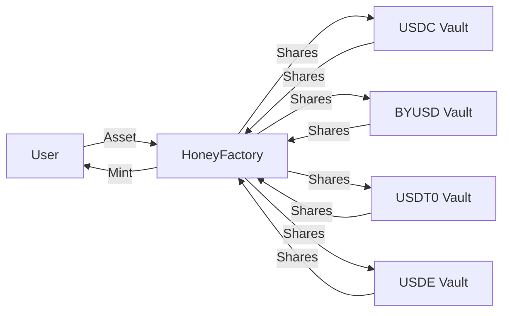

`$HONEY` is Berachain's native stablecoin, designed to provide a stable and reliable means of exchange within the Berachain ecosystem and beyond. `$HONEY` is fully collateralized and soft-pegged to the US Dollar.

## How to get `$HONEY`

`$HONEY` can be minted by depositing whitelisted collateral into a vault and minting `$HONEY` against that collateral through the [HoneySwap dApp](https://honey.berachain.com). The minting rates of `$HONEY` are configurable by `$BGT` governance for each different collateral asset.

Alternatively, `$HONEY` can be obtained by swapping from other assets on BEX or another decentralized exchange.

### Collateral assets

The following assets can be used as collateral to mint `$HONEY`:

- `$USDC`
- `$BYUSD` (`$pyUSD`)
- `$USDT0`
- `$USDE`

New assets used to mint `$HONEY` can be added through governance.

## How is `$HONEY` used?

`$HONEY` shares the same uses as other stablecoins, such as for payments/remittances and as a hedge against market volatility. `$HONEY` can also be used within the Berachain DeFi ecosystem.

## `$HONEY` Architecture

A flow diagram of the `$HONEY` minting process and associated contracts is shown below:

### `$HONEY` vaults

`$HONEY` is minted by depositing eligible collateral into specialized vault contracts. Each vault is specific to a particular collateral type. Currently, all vaults use the same conversion rates: 100% mint rate (0% mint fee) and 99.95% redeem rate (0.05% redeem fee).

### HoneyFactory

At the heart of the `$HONEY` minting process is the HoneyFactory contract. This contract acts as a central hub, connecting all the different `$HONEY` Vaults and is responsible for minting new `$HONEY` tokens.

As shown in the diagram, your deposits are routed through the `HoneyFactory` contract to the appropriate vault. The `HoneyFactory` custodies the shares minted by the vault (corresponding to your deposits) and mints `$HONEY` tokens to you.

## Depegging and basket mode

Basket Mode is a safety mechanism that activates when collateral assets become unstable. It affects both minting and redemption of `$HONEY` in specific ways:

**Redemption:**

- When ANY collateral asset depegs, Basket Mode automatically activates
- In this mode, you can't choose which asset you redeem your `$HONEY` for
- Instead, you redeem for a proportional share of ALL collateral assets in the basket
- For example, if you redeem 1 `$HONEY` token with Basket Mode active, you'll get some of each collateral asset based on their relative proportion as collateral

**Minting:**

- Basket Mode for minting is considered an edge case that only occurs if ALL collateral assets are either depegged or blacklisted. Depegged assets cannot be used to mint `$HONEY`
- In this situation, to mint `$HONEY`, you must provide proportional amounts of all collateral assets in the basket, rather than choosing a single asset
- If one asset is depegged, you can mint only with the other asset

## Fees

`$BGT` holders receive fees collected from minting and redeeming `$HONEY`. The current fee structure is the following:

| Stablecoin | Mint Fee | Redeem Fee |
| ---------- | -------- | ---------- |
| USDT       | 0.1%     | 0%         |
| byUSD      | 0.1%     | 0%         |
| USDC       | 0%       | 0.05%      |
| USDe       | 0%       | 0.05%      |

### Example

Let's walk through minting and redeeming `$HONEY` with `$USDC`:

**Minting:**

- User deposits `1,000 $USDC`
- Receives `1,000 $HONEY` (0% fee)
- No fees collected

**Redeeming:**

- User redeems `1,000 $HONEY` for `$USDC`
- Receives `999.5 $USDC` (0.05% fee = 0.5 $USDC)
- `0.5 $USDC` fee is distributed to `$BGT` holders
