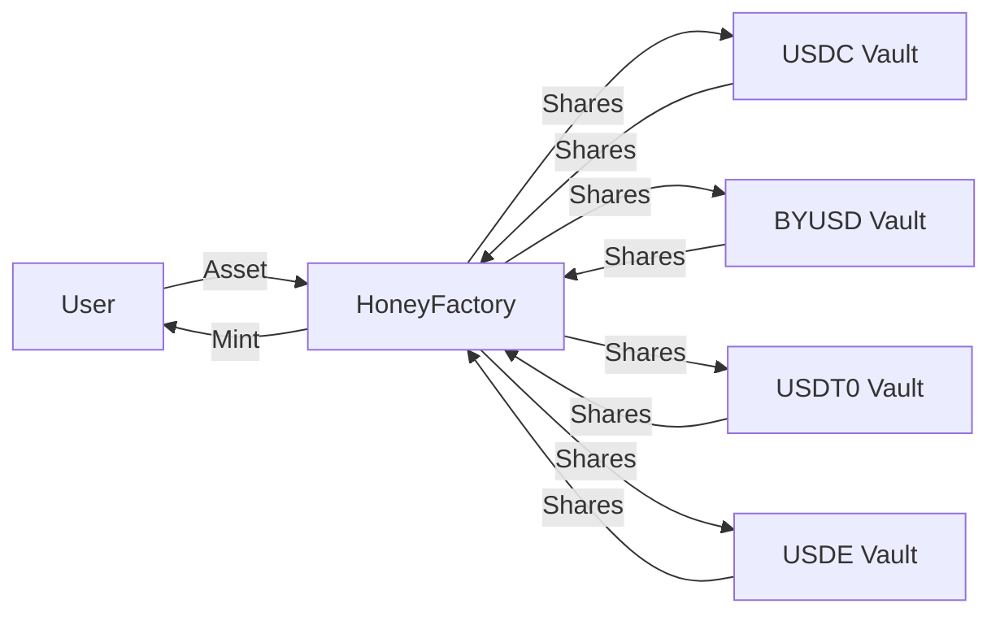

`$HONEY` is soft-pegged to the US Dollar and fully collateralized. It is Berachain's native stablecoin, providing a stable means of exchange within the ecosystem and beyond.

## Using and minting `$HONEY`

`$HONEY` serves the same role as other stablecoins — payments, remittances, hedging against volatility — and is widely used across Berachain DeFi as a base trading pair and lending asset. Minting and redeeming `$HONEY` against collateral happens through [BHoneySwap at honey.berachain.com](https://honey.berachain.com). You can also acquire it by swapping on BEX or another exchange.

The lifecycle is straightforward: deposit a whitelisted collateral asset to mint `$HONEY`, use it however you like, and redeem it for collateral when you're done. Minting and redemption rates are configurable per collateral asset by `$BGT` governance.

### Collateral assets

The following assets can be used as collateral to mint `$HONEY`:

- `$USDC`
- `$BYUSD` (`$pyUSD`)
- `$USDT0`
- `$USDE`

New collateral assets can be added through governance.

## `$HONEY` Architecture

A flow diagram of the `$HONEY` minting process and associated contracts is shown below:

### `$HONEY` vaults

`$HONEY` is minted by depositing eligible collateral into specialized vault contracts. Each vault is specific to a particular collateral type. Mint and redeem rates are configured independently per collateral asset — see [Fees](#fees) for the current values.

### Collateral custody

Governance can designate a vault as a custody vault by setting a custodian address. When custody is enabled for a vault, deposited collateral is automatically forwarded from the vault contract to the custodian. On redemption, collateral is pulled back from the custodian before being returned to the user. The vault's share accounting is unaffected — the 1:1 exchange rate between collateral and vault shares is maintained regardless of where the underlying assets are held.

Custody can be removed by governance, which transfers all collateral back from the custodian to the vault contract.

### HoneyFactory

At the heart of the `$HONEY` minting process is the [`HoneyFactory`](https://beratrail.io/address/0xA4aFef880F5cE1f63c9fb48F661E27F8B4216401) contract (same address on mainnet and Bepolia). This contract acts as a central hub, connecting all the different `$HONEY` Vaults and is responsible for minting new `$HONEY` tokens.

As shown in the diagram, your deposits are routed through the `HoneyFactory` contract to the appropriate vault. The `HoneyFactory` custodies the shares minted by the vault (corresponding to your deposits) and mints `$HONEY` tokens to you.

## Depegging and basket mode

Basket Mode is a safety mechanism that activates when collateral assets become unstable. It affects both minting and redemption of `$HONEY` in specific ways:

**Redemption:**

- When ANY collateral asset depegs, Basket Mode automatically activates
- In this mode, you can't choose which asset you redeem your `$HONEY` for
- Instead, you redeem for a proportional share of ALL collateral assets in the basket
- For example, if you redeem 1 `$HONEY` token with Basket Mode active, you'll get some of each collateral asset based on their relative proportion as collateral

**Minting:**

- Basket Mode for minting is considered an edge case that only occurs if ALL collateral assets are either depegged or blacklisted. Depegged assets cannot be used to mint `$HONEY`
- In this situation, to mint `$HONEY`, you must provide proportional amounts of all collateral assets in the basket, rather than choosing a single asset
- If one asset is depegged, you can mint only with the other asset

## Gasless transfers and approvals

`$HONEY` supports two ERC-20 extensions that allow transactions to be submitted by a third party on behalf of the token holder, removing the need for the holder to pay gas:

- **EIP-2612 `permit`** — lets a holder sign an off-chain message authorizing a spender allowance. A relayer or contract can then submit the permit on-chain, so the holder never sends a transaction. This is the same interface used by USDC, DAI, and most modern ERC-20 tokens.
- **EIP-3009 `transferWithAuthorization` / `receiveWithAuthorization`** — lets a holder sign an off-chain message authorizing a one-time transfer to a specific recipient. The recipient (or a relayer) submits it on-chain. Each authorization includes a unique nonce to prevent replay.

Both extensions use [EIP-712](https://eips.ethereum.org/EIPS/eip-712) typed structured data for signatures.

## Fees

`$BGT` holders receive fees collected from minting and redeeming `$HONEY`. The current fee structure is the following:

| Stablecoin | Mint Fee | Redeem Fee |
| ---------- | -------- | ---------- |
| USDT       | 0.1%     | 0%         |
| byUSD      | 0.1%     | 0%         |
| USDC       | 0%       | 0.05%      |
| USDe       | 0%       | 0.05%      |

Let's walk through minting and redeeming `$HONEY` with `$USDC`:

**Minting:**

- User deposits `1,000 $USDC`
- Receives `1,000 $HONEY` (0% fee)
- No fees collected

**Redeeming:**

- User redeems `1,000 $HONEY` for `$USDC`
- Receives `999.5 $USDC` (0.05% fee = 0.5 $USDC)
- `0.5 $USDC` fee is distributed to `$BGT` holders
