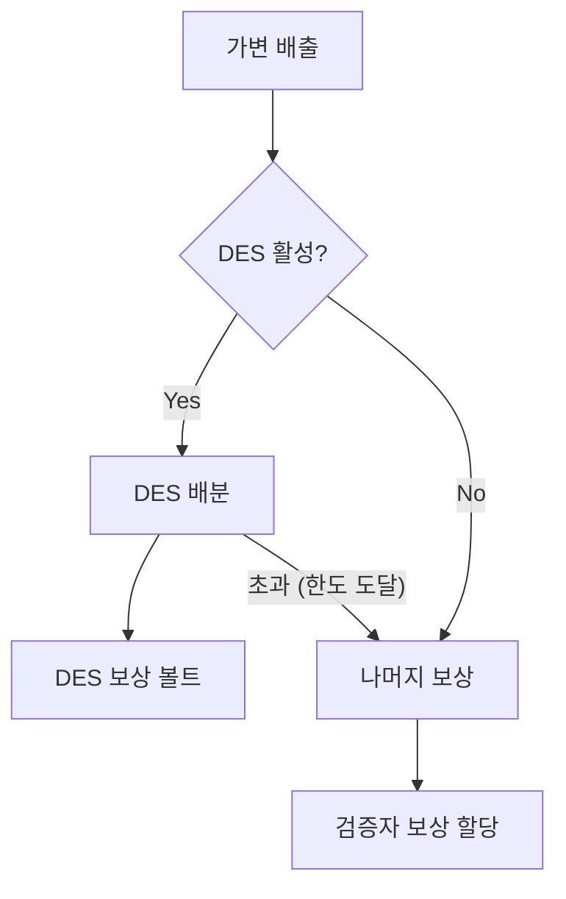

유동성 증명은 `$BGT` 토큰을 사용하여 Berachain의 블록 보상 및 토큰 배출을 관리합니다. 이 페이지에서는 검증자 선택, 블록 보상, 배출 계산의 수학적 원리를 설명합니다.

## 검증자 선택

네트워크는 블록 생산 자격이 있는 **69명의 검증자**의 활성 세트를 유지합니다. 선택 기준에는 다음이 포함됩니다:

- `$BERA` 스테이크 순 상위 **69명의 검증자**만 활성 세트에 포함
- 블록 제안 확률은 스테이킹된 `$BERA`에 비례하며 보상 금액에는 영향을 주지 않음
- 검증자당 스테이크 제한:
  - 최소: 250,000 `$BERA`
  - 최대: 10,000,000 `$BERA`

주어진 검증자가 블록 생산을 위해 선택될 확률은 활성 세트의 총 스테이크에 대한 해당 검증자 스테이크 비중입니다.

## $BGT 배출 구조

검증자가 블록을 생산할 때 `$BGT` 토큰은 두 가지 배출 구성 요소를 통해 배출됩니다:

1. 기본 배출
   - `base rate` 파라미터(B)와 동일한 **고정 금액**
   - 블록 생산 검증자에게 직접 지급

2. 보상 볼트 배출
   - 검증자의 boost(x)에 따른 **변동 금액**
     - 즉, 검증자에게 위임된 총 `$BGT`의 비율
   - 검증자가 선택한 [보상 볼트](/ko/general/proof-of-liquidity/reward-vaults)에 분배됨
     - 검증자의 보상 할당에 구성된 가중치에 비례
     - 검증자는 보상 볼트로 전달한 금액에 따라 프로젝트로부터 [인센티브](/ko/general/proof-of-liquidity/incentives)를 받음

## 검증자 부스트

Boost는 검증자의 보상 배출을 결정하는 중요한 지표입니다:

- 네트워크에 위임된 총 `$BGT` 대비 검증자가 위임받은 `$BGT`의 비율로 계산
- 0과 1 사이의 소수로 표현
- 예: 검증자에게 1000 `$BGT`가 위임되고 네트워크에 총 10000 `$BGT`가 위임된 경우 boost는 0.1(10%). 더 높은 boost는 배출 공식에 따라 더 높은 보상 배출로 이어짐

## BeraChef: 보상 할당 관리

BeraChef는 검증자가 BGT 보상을 다양한 보상 볼트로 어떻게 전달하는지 관리하는 핵심 컨트랙트입니다. 검증자 선호도에 기반한 보상 분배를 결정하는 구성 레이어 역할을 합니다.

### 핵심 책임

BeraChef는 보상 시스템의 세 가지 핵심 측면을 관리합니다:

1. **보상 할당** - 각 보상 볼트로 가는 보상 비율을 결정하는 가중치 목록 유지
2. **검증자 수수료** - 검증자가 인센티브 토큰에 부과할 수 있는 수수료율 관리
3. **볼트 화이트리스트** - BGT 보상을 받을 자격이 있는 볼트 제어

### 보상 할당 작동 방식

각 검증자는 BGT 보상이 어떻게 분배되어야 하는지 지정하는 사용자 정의 보상 할당을 설정할 수 있습니다.

보상 할당은 다음으로 설명됩니다:

1. 선택된 볼트 목록과 주어진 블록의 BGT 보상 중 각 볼트로 보낼 비율. 가중치의 합은 100이어야 합니다.
2. 할당이 효력이 발생하는 블록 번호.

검증자는 450블록의 지연을 조건으로 BeraChef 보상 할당에 대한 제어를 행사합니다.

**검증자가 302,400블록(약 7일) 내에 커팅 보드를 업데이트하지 않으면** BeraChef는 _baseline_ 커팅 보드를 적용하기 시작합니다. 이 _baseline_ 할당은 활성 인센티브가 있는 보상 볼트로 배출을 효율적으로 전달하도록 선택됩니다.

### 수수료 관리

BeraChef는 다음 제약 조건으로 검증자 인센티브 토큰 수수료율을 관리합니다:

- **기본 수수료**: 명시적으로 설정하지 않으면 5%
- **최대 수수료**: 컨트랙트가 적용하는 20% 하드 캡
- **변경 지연**: 수수료 변경이 효력이 발생하기 전 필요한 대기 기간

## 블록당 $BGT 배출

블록당 배출되는 총 `$BGT`는 다음 공식을 사용하여 계산됩니다:

$$emission = \left[B + \max\left(m, (a + 1)\left(1 - \frac{1}{1 + ax^b}\right)R\right)\right]$$

### 파라미터

| 파라미터                       | 설명                                                    | 영향                                         |
| ----------------------------- | ------------------------------------------------------- | -------------------------------------------- |
| x (boost)                     | 검증자에게 위임된 총 `$BGT`의 비율(범위: [0,1])         | 보상 볼트에 대한 `$BGT` 배출 결정            |
| B (base rate)                 | 블록 생산을 위한 `$BGT` 고정 금액                        | 기준 검증자 보상 결정                        |
| R (reward rate)               | 보상 볼트를 위한 기본 `$BGT` 금액                        | 보상 배출의 기반 설정                        |
| a (boost multiplier)         | Boost 영향 계수                                         | 값이 높을수록 boost 중요성 증가              |
| b (convexity parameter)      | Boost 영향 곡선 가파름                                  | 값이 높을수록 낮은 boost에 더 큰 불이익      |
| m (minimum boosted reward rate) | 보상 볼트 배출의 최저선                               | 값이 높을수록 낮은 boost 검증자에게 유리     |

이 공식은 블록의 총 가변 배출량을 나타냅니다. [Dedicated emission stream](#dedicated-emission-stream)이 활성화되어 있으면 일부가 먼저 DES 볼트로 분배되고, 나머지가 검증자의 보상 할당에 적용됩니다.

### 샘플 배출 차트

다음 샘플 파라미터를 사용하여 아래 차트는 `$BGT` 위임에 따라 배출이 어떻게 확장되는지 보여줍니다:

$$B = 0.4, R = 0.65, a = 3.5, b = 0.4, m = 0$$

<Frame>
  
</Frame>

## 최대 블록 인플레이션

`$BGT` 배출은 검증자가 가진 boost 양에 따라 상한까지 증가합니다. 최대 이론적 블록 배출은 100% boost에서 발생합니다:

$$\max \mathbb{E}[\text{emission}] = \left[B + \max(m, aR)\right]$$

## Dedicated emission stream

검증자의 보상 할당이 적용되기 전에, Distributor는 가변 배출의 일부를 거버넌스가 지정한 보상 볼트에 배분할 수 있습니다. 이 메커니즘을 **Dedicated Emission Stream (DES)**이라고 합니다.

`DedicatedEmissionStreamManager` 컨트랙트는 세 가지 파라미터를 제어하며, 모두 거버넌스에 의해 설정됩니다:

- **`emissionPerc`** — 각 블록의 가변 보상에서 배분되는 비율로, basis points로 표시되며 만점은 10,000입니다. 500은 5%를 의미합니다.
- **`targetEmission`** — 볼트별 누적 한도. 볼트가 목표 DES 배출량에 도달하면 추가 배분이 중단됩니다. 초과분은 해당 블록 검증자의 보상 할당으로 반환됩니다.
- **보상 할당 가중치** — 화이트리스트된 보상 볼트 목록과 배분 내 각 볼트의 몫으로, BeraChef와 동일한 가중치 형식을 사용합니다 (비율의 합이 100%여야 합니다).

### 검증자에 대한 영향

DES 배분은 검증자가 지시할 수 있는 유효 가변 보상을 줄입니다. `emissionPerc`가 5%로 설정되면, 블록을 생성하는 검증자는 BeraChef 보상 할당에 따라 배분할 가변 배출의 95%를 받게 됩니다. 기본 배출(검증자 operator에게 직접 지급)은 영향을 받지 않습니다.

현재 DES 파라미터(배분 비율, 대상 볼트, 볼트별 한도 포함)는 온체인 [`DedicatedEmissionStreamManager`](/build/getting-started/deployed-contracts) 컨트랙트에서 확인할 수 있습니다.

## $BGT 분배

Distributor는 블록 단위로 보상 볼트에 `$BGT`를 배출합니다. 네트워크는 주어진 블록에 대한 분배를 다음 블록 동안 처리합니다. 이를 통해 보상 볼트 스테이커가 청구할 수 있는 `$BGT`가 생성됩니다.

네트워크는 블록 단위로 보상을 생성하지만 **3일 동안** 분배합니다. 예치자는 예치 금액에 비례하여 이 기간에 걸쳐 선형으로 스트리밍되는 보상을 받습니다. 보상 창은 새 보상이 도착할 때마다 재설정됩니다.

### 분배 예시

Berachain에서 `$BGT`는 블록 단위로 분배되므로, 3일 분배 기간은 지속적으로 "시작"이 현재 블록으로 밀리는 것으로 봐야 합니다. 따라서 이 기간은 이전 3일 동안 어느 시점의 배출을 기반으로 한 슬라이딩 윈도우로 봐야 합니다.

간소화된 숫자로 더 현실적인 예시:

- 3일간 매일 3 `$BGT` 분배, 9일간 총 27
- 1명의 예치자, 모든 예치 소유

<Frame>
  
</Frame>

**범례**

- Emitted: 분배되고 사용 가능한 총 `$BGT` 수
- Claimable: 예치자가 청구할 수 있는 총 `$BGT` 수
- Daily Reward: 배출 토큰 잠금 해제를 기반으로 청구 가능으로 표시된 일일 `$BGT` 수

이를 통해 예치자는 3일 후 보상이 포화점에 도달할 때까지 매일 증가하는 양의 `$BGT`를 받게 되며, 그 시점부터 모든 보상이 적극적으로 분배됩니다.

보상 기간은 보상을 즉시 청구할 수 있게 하는 대신 이 분배 메커니즘을 통해 예치자와 생태계 일치를 인센티브합니다.

## Boost APR 계산

Boost APR은 [Berachain Hub](https://hub.berachain.com) 전반에 표시됩니다.

<Frame>
  
</Frame>

Boost APR %는 시작 블록과 종료 블록으로 정의된 블록 범위를 사용하여 계산됩니다. 백분율이 계산되는 시점에 APR 계산기는 모든 토큰의 가격을 ($BERA 기준) 샘플링합니다.
