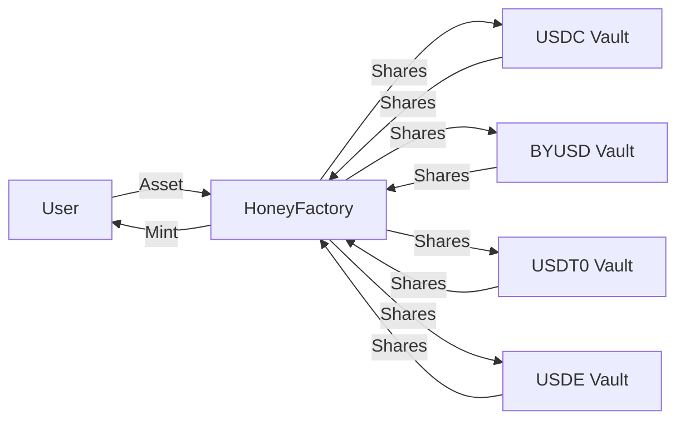

`$HONEY`는 미국 달러에 소프트 페깅되고 완전 담보화된 Berachain의 네이티브 스테이블코인으로, 생태계 안팎에서 안정적인 교환 수단을 제공합니다.

## $HONEY 사용 및 민팅

`$HONEY`는 다른 스테이블코인과 같은 역할을 합니다 — 결제, 송금, 변동성 헤지 — 그리고 Berachain DeFi 전반에서 기본 거래 쌍 및 대출 자산으로 널리 사용됩니다. [HoneySwap](https://honey.berachain.com)을 통해 담보로 `$HONEY`를 민팅하고 상환할 수 있으며, BEX 또는 다른 거래소에서 스왑하여 얻을 수도 있습니다.

라이프사이클은 간단합니다: 화이트리스트된 담보 자산을 예치하여 `$HONEY`를 민팅하고, 자유롭게 사용한 뒤, 완료되면 담보로 상환합니다. 민팅 및 상환 요율은 담보 자산별로 `$BGT` 거버넌스에서 구성합니다.

### 담보 자산

다음 자산을 담보로 사용하여 `$HONEY`를 민팅할 수 있습니다:

- `$USDC`
- `$BYUSD` (`$pyUSD`)
- `$USDT0`
- `$USDE`

새 담보 자산은 거버넌스를 통해 추가할 수 있습니다.

## $HONEY 아키텍처

`$HONEY` 민팅 프로세스 및 관련 컨트랙트의 흐름도는 다음과 같습니다:

### $HONEY 볼트

`$HONEY`는 자격을 갖춘 담보를 전용 볼트 컨트랙트에 예치하여 민팅됩니다. 각 볼트는 특정 담보 유형에 해당합니다. 민팅 및 상환 요율은 담보 자산별로 독립적으로 구성됩니다 — 현재 값은 [수수료](#수수료)를 참조하세요.

### 담보 수탁

거버넌스는 수탁자 주소를 설정하여 볼트를 수탁 볼트로 지정할 수 있습니다. 수탁이 활성화되면 예치된 담보는 볼트 컨트랙트에서 수탁자에게 자동으로 전달됩니다. 상환 시 담보는 수탁자로부터 다시 가져온 후 사용자에게 반환됩니다. 볼트의 주식 회계는 영향을 받지 않습니다 — 기초 자산이 어디에 보관되든 담보와 볼트 주식 간 1:1 환율이 유지됩니다.

거버넌스가 수탁을 해제하면 모든 담보가 수탁자로부터 볼트 컨트랙트로 다시 이전됩니다.

### HoneyFactory

`$HONEY` 민팅 프로세스의 핵심은 [`HoneyFactory`](https://beratrail.io/address/0xA4aFef880F5cE1f63c9fb48F661E27F8B4216401) 컨트랙트입니다(메인넷과 Bepolia 동일 주소). 이 컨트랙트는 모든 `$HONEY` 볼트를 연결하는 중앙 허브 역할을 하며 새 `$HONEY` 토큰 민팅을 담당합니다.

다이어그램에서와 같이 예치는 HoneyFactory 컨트랙트를 통해 해당 볼트로 라우팅됩니다. HoneyFactory는 볼트가 민팅한 주식(예치에 해당)을 수탁하고 사용자에게 `$HONEY` 토큰을 민팅합니다.

## 디페깅 및 바스켓 모드

바스켓 모드는 담보 자산이 불안정해질 때 활성화되는 안전 메커니즘입니다. 특정 방식으로 `$HONEY`의 민팅 및 상환에 영향을 미칩니다:

**상환:**

- **어떤** 담보 자산이 디페그되면 바스켓 모드가 자동으로 활성화됩니다
- 이 모드에서는 `$HONEY`를 어떤 자산으로 상환할지 선택할 수 없습니다
- 대신 바스켓의 **모든** 담보 자산에 비례한 몫으로 상환됩니다
- 예: 바스켓 모드가 활성화된 상태에서 1 `$HONEY` 토큰을 상환하면 담보로 상대적 비율에 따라 각 담보 자산의 일부를 받게 됩니다

**민팅:**

- 민팅을 위한 바스켓 모드는 **모든** 담보 자산이 디페그되거나 블랙리스트에 올라간 경우에만 발생하는 엣지 케이스로 간주됩니다. 디페그된 자산은 `$HONEY` 민팅에 사용할 수 없습니다
- 이 상황에서 `$HONEY`를 민팅하려면 단일 자산을 선택하는 대신 바스켓의 모든 담보 자산의 비례 금액을 제공해야 합니다
- 자산 하나가 디페그되면 다른 자산으로만 민팅할 수 있습니다

## 수수료

`$BGT` 보유자는 `$HONEY` 민팅 및 상환에서 수집된 수수료를 받습니다. 현재 수수료 구조는 다음과 같습니다:

| 스테이블코인 | 민팅 수수료 | 상환 수수료 |
| ------------ | ----------- | ------------ |
| USDT         | 0.1%        | 0%           |
| byUSD        | 0.1%        | 0%           |
| USDC         | 0%          | 0.05%        |
| USDe         | 0%          | 0.05%        |

### 예시

`$USDC`로 `$HONEY` 민팅 및 상환을 단계별로 살펴보겠습니다:

**민팅:**

- 사용자가 `1,000 $USDC` 예치
- `1,000 $HONEY` 수령(0% 수수료)
- 수수료 없음

**상환:**

- 사용자가 `1,000 $HONEY`를 `$USDC`로 상환
- `999.5 $USDC` 수령(0.05% 수수료 = 0.5 $USDC)
- `0.5 $USDC` 수수료가 `$BGT` 보유자에게 분배됨

## 가스 없는 전송 및 승인

`$HONEY`는 토큰 보유자를 대신하여 제3자가 트랜잭션을 제출할 수 있는 두 가지 ERC-20 확장을 지원하므로, 보유자가 가스를 지불할 필요가 없습니다:

- **EIP-2612 `permit`** — 보유자가 오프체인 메시지에 서명하여 지출 한도를 승인합니다. 릴레이어 또는 컨트랙트가 온체인에서 permit을 제출하므로 보유자는 트랜잭션을 보낼 필요가 없습니다. USDC, DAI 및 대부분의 최신 ERC-20 토큰과 동일한 인터페이스입니다.
- **EIP-3009 `transferWithAuthorization` / `receiveWithAuthorization`** — 보유자가 오프체인 메시지에 서명하여 특정 수신자에게 일회성 전송을 승인합니다. 수신자(또는 릴레이어)가 온체인에서 제출합니다. 각 승인에는 재사용 방지를 위한 고유 nonce가 포함됩니다.

두 확장 모두 서명에 [EIP-712](https://eips.ethereum.org/EIPS/eip-712) 타입 구조화 데이터를 사용합니다.
