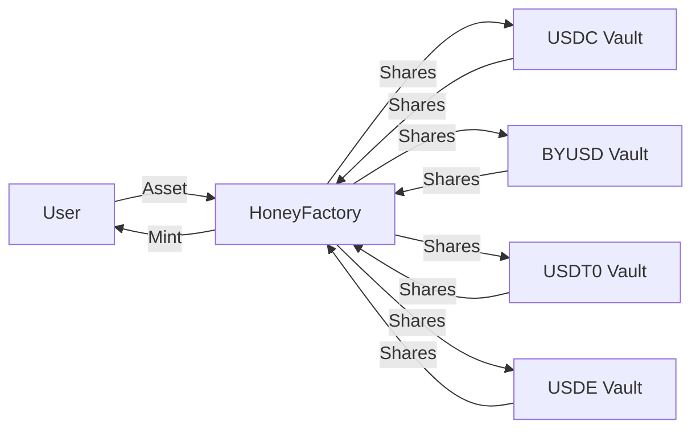

`$HONEY`는 Berachain 생태계 및 그 이상에서 안정적이고 신뢰할 수 있는 교환 수단을 제공하도록 설계된 Berachain의 네이티브 스테이블코인입니다. `$HONEY`는 완전 담보화되어 있으며 미국 달러에 소프트 페깅됩니다.

## $HONEY 받는 방법

`$HONEY`는 [HoneySwap dApp](https://honey.berachain.com)을 통해 화이트리스트된 담보를 볼트에 예치하고 해당 담보에 대해 `$HONEY`를 민팅하여 얻을 수 있습니다. 각 담보 자산에 대한 `$HONEY` 민팅 요율은 `$BGT` 거버넌스에서 구성할 수 있습니다.

또는 BEX 또는 다른 탈중앙화 거래소에서 다른 자산과 스왑하여 `$HONEY`를 얻을 수 있습니다.

### 담보 자산

다음 자산을 담보로 사용하여 `$HONEY`를 민팅할 수 있습니다:

- `$USDC`
- `$BYUSD` (`$pyUSD`)
- `$USDT0`
- `$USDE`

`$HONEY` 민팅에 사용되는 새 자산은 거버넌스를 통해 추가할 수 있습니다.

## $HONEY는 어떻게 사용되나요?

`$HONEY`는 결제/송금 및 시장 변동성에 대한 헤지와 같이 다른 스테이블코인과 동일한 용도로 사용됩니다. `$HONEY`는 Berachain DeFi 생태계 내에서도 사용할 수 있습니다.

## $HONEY 아키텍처

`$HONEY` 민팅 프로세스 및 관련 컨트랙트의 흐름도는 다음과 같습니다:

### $HONEY 볼트

`$HONEY`는 자격을 갖춘 담보를 전용 볼트 컨트랙트에 예치하여 민팅됩니다. 각 볼트는 특정 담보 유형에 해당합니다. 현재 모든 볼트는 동일한 변환 요율을 사용합니다: 100% 민팅 요율(0% 민팅 수수료) 및 99.95% 상환 요율(0.05% 상환 수수료).

### HoneyFactory

`$HONEY` 민팅 프로세스의 핵심은 HoneyFactory 컨트랙트입니다. 이 컨트랙트는 모든 `$HONEY` 볼트를 연결하는 중앙 허브 역할을 하며 새 `$HONEY` 토큰 민팅을 담당합니다.

다이어그램에서와 같이 예치는 HoneyFactory 컨트랙트를 통해 해당 볼트로 라우팅됩니다. HoneyFactory는 볼트가 민팅한 주식(예치에 해당)을 수탁하고 사용자에게 `$HONEY` 토큰을 민팅합니다.

## 디페깅 및 바스켓 모드

바스켓 모드는 담보 자산이 불안정해질 때 활성화되는 안전 메커니즘입니다. 특정 방식으로 `$HONEY`의 민팅 및 상환에 영향을 미칩니다:

**상환:**

- **어떤** 담보 자산이 디페그되면 바스켓 모드가 자동으로 활성화됩니다
- 이 모드에서는 `$HONEY`를 어떤 자산으로 상환할지 선택할 수 없습니다
- 대신 바스켓의 **모든** 담보 자산에 비례한 몫으로 상환됩니다
- 예: 바스켓 모드가 활성화된 상태에서 1 `$HONEY` 토큰을 상환하면 담보로 상대적 비율에 따라 각 담보 자산의 일부를 받게 됩니다

**민팅:**

- 민팅을 위한 바스켓 모드는 **모든** 담보 자산이 디페그되거나 블랙리스트에 올라간 경우에만 발생하는 엣지 케이스로 간주됩니다. 디페그된 자산은 `$HONEY` 민팅에 사용할 수 없습니다
- 이 상황에서 `$HONEY`를 민팅하려면 단일 자산을 선택하는 대신 바스켓의 모든 담보 자산의 비례 금액을 제공해야 합니다
- 자산 하나가 디페그되면 다른 자산으로만 민팅할 수 있습니다

## 수수료

`$BGT` 보유자는 `$HONEY` 민팅 및 상환에서 수집된 수수료를 받습니다. 현재 수수료 구조는 다음과 같습니다:

| 스테이블코인 | 민팅 수수료 | 상환 수수료 |
| ------------ | ----------- | ------------ |
| USDT         | 0.1%        | 0%           |
| byUSD        | 0.1%        | 0%           |
| USDC         | 0%          | 0.05%        |
| USDe         | 0%          | 0.05%        |

### 예시

`$USDC`로 `$HONEY` 민팅 및 상환을 단계별로 살펴보겠습니다:

**민팅:**

- 사용자가 `1,000 $USDC` 예치
- `1,000 $HONEY` 수령(0% 수수료)
- 수수료 없음

**상환:**

- 사용자가 `1,000 $HONEY`를 `$USDC`로 상환
- `999.5 $USDC` 수령(0.05% 수수료 = 0.5 $USDC)
- `0.5 $USDC` 수수료가 `$BGT` 보유자에게 분배됨
