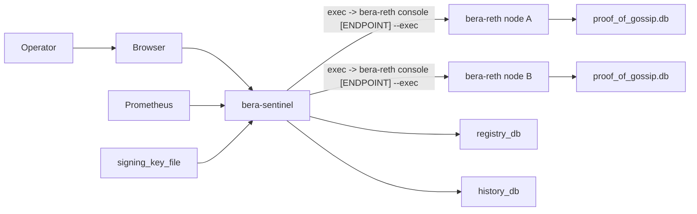

Deploy Proof of Gossip from bottom to top:

1. enable PoG on each `bera-reth` node
2. choose how `bera-sentinel` will reach that node’s admin surface
3. deploy `bera-sentinel` with signer key and persistent databases
4. expose the console and metrics endpoints to the right operators and monitoring systems

That sequence matters because every later decision depends on the access model you choose for `bera-reth`.



## 1. Start with `bera-reth`

Every PoG deployment begins by enabling the PoG runtime in the execution client:

```bash
bera-reth node --bera.pog
```

That flag enables the live `beradmin_*` methods, the node-side watcher, and the PoG state used by sentinel-driven canary probing.

Each node also needs a persistent datadir. That is where `bera-reth` stores `proof_of_gossip.db`, which holds probe results for that node.

## 2. Choose how operators will reach admin functions

`bera-sentinel` does not speak directly to the node over a dedicated PoG transport. It shells out to:

```bash
bera-reth console [ENDPOINT] --exec "<method> <json params>"
```

The console can target:

- an IPC socket path

### When IPC is best

IPC is the default and safest choice when admin methods are not exposed on any network-facing RPC. That is common for operators who keep `beradmin_*` private and local to the node host or pod.

Use IPC when:

- you want the narrowest trust boundary
- admin RPC is intentionally not exposed over HTTP or WS
- your sentinel host can reach the node environment with local execution, `ssh`, or `kubectl exec`

## 3. If you choose IPC, decide how sentinel reaches it

IPC is only useful if the sentinel can get to the socket. Two practical patterns are common:

### Kubernetes: `kubectl exec`

This works well when the sentinel runs with Kubernetes credentials and the node socket is reachable from inside the pod namespace.

Example:

```toml
[[nodes]]
name = "node-1"
exec = "kubectl exec -n berachain pod/node-1 -- bera-reth console"
group = "validators"
exec_timeout_secs = 15
```

### SSH to the node host

This works well when the operator already has SSH-based automation and the IPC socket is local to the node machine.

Example:

```toml
[[nodes]]
name = "node-1"
exec = "ssh reth@node-1 bera-reth console"
group = "validators"
exec_timeout_secs = 15
```

### Local or forwarded socket

If you already forward the socket onto the sentinel host, you can call the console directly with an explicit endpoint path:

```toml
[[nodes]]
name = "node-1"
exec = "/path/to/bera-reth console /tmp/reth.ipc"
group = "validators"
exec_timeout_secs = 15
```

This is the same console contract, just with the endpoint supplied positionally.

## 4. Deploy `bera-sentinel`

On the sentinel host, you need:

- a readable `signing_key_file`
- persistent `registry_db`
- persistent `history_db`
- a `ws_addr` for browser and API access
- a `metrics_addr` for Prometheus

The sentinel is the operational brain. It does not need direct block-building responsibilities; it needs:

- stable access to every node you want to monitor
- a funded signer for canary transactions
- enough persistence to keep operator baseline, overrides, capabilities, history, and attribution aggregates

If you discard `registry_db`, you also discard capability toggles, operator baseline, runtime overrides, subnet blocklist state, and attribution aggregates.

## 5. Expose console and metrics deliberately

`ws_addr` serves more than a pretty dashboard. It serves:

- `/health`
- `/events`
- `/console/snapshot`
- `/console/ws`
- `/console/peer/:peer_id`
- `/console/command`

That makes it an operator control surface, not just a read-only web page.

`metrics_addr` is separate and should be scraped by Prometheus.

## 6. Roll out capabilities in stages

The safest way to deploy PoG is:

1. bring up sentinel with collection and console visibility
2. verify node reachability, poll latency, signer funding, and snapshot correctness
3. enable probing
4. only then enable enforcement and subnet automation

This matters because destructive behaviors are capability-gated, persisted in the registry database, and should be enabled intentionally.

## Monitoring and operational checks

At minimum, monitor:

- probe success and timeout rates
- zombie growth and subnet concentration
- node reachability
- poll latency and exec failures
- signer balance
- database growth

The broader node baseline still applies. See [Production Checklist](/nodes/operations/production-checklist) and [Monitoring](/nodes/operations/monitoring).

## Next steps

- [Configuration Reference](/nodes/proof-of-gossip/configuration)
- [Using the Console](/nodes/proof-of-gossip/using-the-console)
- [Proof of Gossip](/nodes/proof-of-gossip)
