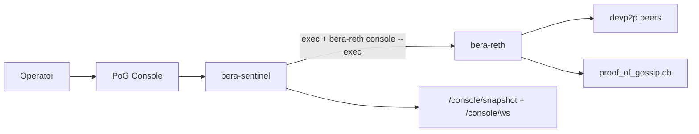
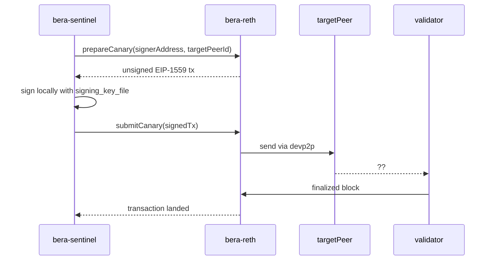

Proof of Gossip keeps your node connected to peers that matter.

For RPC and infrastructure operators, it continuously tests whether peers can actually get transactions on-chain and cuts out peers or subnets that fail. For validators, it identifies which peers are real sources of transaction flow.

## High-level design

Proof of Gossip has two components:

- **Bera-Reth** provides PoG extensions inside the execution client: directed canary delivery, richer peer data, and validator-relevant transaction provenance. Enabled with a single option.
- **Bera-Sentinel** operates those nodes as a fleet: it probes peers with signed canary transactions, tracks outcomes, classifies peer quality, and applies operator policy across nodes.

Result: peer quality becomes observable, enforceable, and useful for operations.

## Start here

<CardGroup cols={2}>
  <Card title="Configuration" href="/nodes/proof-of-gossip/configuration">
    Configure `sentinel.toml`, `exec` transport, signer handling, and `bera-reth` flags.
  </Card>
  <Card title="Using the Console" href="/nodes/proof-of-gossip/using-the-console">
    Learn the real tabs, filters, snapshot routes, and runtime controls in the live UI.
  </Card>
  <Card title="Deployment" href="/nodes/proof-of-gossip/deployment">
    Deploy PoG safely with the right trust boundary, persistence, and monitoring setup.
  </Card>
</CardGroup>

## What operators get today

- **Active peer testing** through canary transactions
- **Peer classification** that feeds connected, untested, suspect, zombie, and relaying views
- **Validator-focused attribution** for transactions in blocks your fleet sealed
- **Operator-specific views** in the console for validator, CEX, and infra workflows
- **Actionable peer quality signals** instead of purely heuristic scoring

## Transport and control path

`bera-sentinel` does **not** call a sidecar HTTP service. It shells out to the command prefix configured for each node, then appends `--exec "<method> <json params>"` to run the current `beradmin_*` methods inside `bera-reth`.

## Canary model

The canary model is core PoG mechanism. Sentinel does not guess peer quality from heuristics alone. It creates a tiny real transaction, directs that transaction toward a specific peer, then watches chain activity to see whether that peer was able to get it on-chain.

Process on the happy path:

1. `bera-sentinel` chooses a target peer and requests an unsigned canary from `bera-reth`.
2. The sentinel signer signs that transaction locally.
3. `bera-reth` validates signer, nonce, destination, and value, then sends canary directly to target peer over devp2p.
4. When the canary makes it through the network and into a finalized block, `bera-reth` reports that the transaction landed and sentinel records a successful result.

This gives operators direct evidence about whether a peer can carry transaction flow that lands on-chain.

## Current limits you should understand

- **Attribution is not chain-wide.** It only reflects blocks this node tracked as sealed by us.
- **Attribution is not yet a durable history export.** The current live path is `beradmin_sealedBlockAttribution`, not a cursor-paginated fact stream.
- **Probe durability and attribution durability are different.** Probe results are written to `proof_of_gossip.db`; first-relayer attribution is still derived from in-memory windows.
- **The docs in this section describe shipped behavior.** Future durable sealed provenance work should be treated as planned until it appears in code and the live RPC surface.

## Before you deploy

- Make sure your PoG signing key is funded
- Decide which nodes belong in which logical groups
- Confirm your `exec` path to each node is reliable
- Enable `--bera.pog` on the relevant `bera-reth` nodes
- Plan how you will monitor probe failure rates and zombie counts
