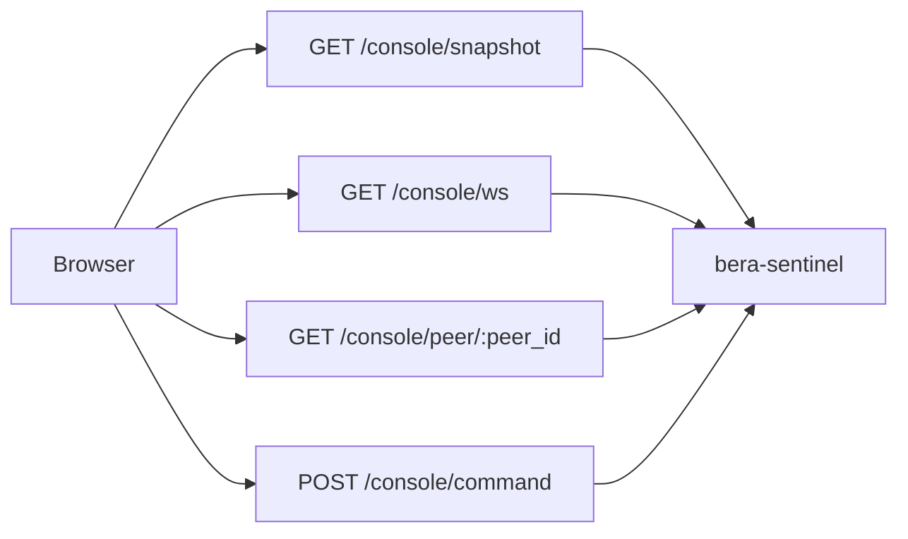

The PoG console is served directly by `bera-sentinel` on the configured `ws_addr`. The browser experience is built from:

- `GET /console/snapshot` for the initial state
- `GET /console/ws` for live updates
- `GET /console/peer/:peer_id` for peer detail fetches
- `POST /console/command` for actions such as probes, subnet changes, and runtime settings

## Status tab

The **Status** tab is the operational overview. It combines:

- fleet health
- operator status such as uptime, last poll age, probing, signer, and balance
- node cards grouped by fleet membership
- the peering matrix
- the event log filters for **Actions**, **Probes**, and **Health**

This is the best place to answer: “is the fleet healthy right now, and is PoG actively doing what I expect?”

## Peers tab

The **Peers** tab focuses on the current working set of peers and their classification state.

Visible controls in the current UI include:

- **All**
- **Connected**
- **Zombie**
- **Untested**
- **Relaying**

In the current implementation, the UI label **Relaying** is the console presentation for peers classified as `confirmed`.

Use this view to answer:

- which peers are currently connected
- which peers are relaying well enough to count as healthy
- which peers are repeatedly failing probes or need closer inspection
- which nodes are connected to a given peer

## Subnets tab

The **Subnets** tab gives you two related views:

- **Current /24s** for subnets with more than one connected peer
- **Known subnets** from the registry, including zombie counts and block status

Current filters visible in the UI:

- **All**
- **Watch**
- **Has zombies**
- **Export CIDR ↓**

Use this page to spot concentration, zombie-heavy subnets, and candidates for manual or automatic blocking.

## Attribution tab

The **Attribution** tab is validator-oriented. It summarizes peer contribution to transactions included in blocks your validator group sealed.

The live table currently shows:

- **Peer**
- **Tips**
- **Sealed Txs**
- **Connected To**

Important scope note:

- attribution is meaningful only for validator groups
- the current implementation is compact and latest-oriented
- it is not a durable fleet-wide historical export

If you run only infrastructure groups, attribution may be absent or null.

## Settings tab

The **⚙** tab exposes the live runtime controls stored by the sentinel.

The current UI includes sections for:

- **Fleet** tunables such as poll interval
- **Probing**
- **Enforcement**
- **Intra-group peering**
- **Subnet auto-block**
- **Peer sharing**
- **Identity**

These settings are important because the live effective configuration is not just the TOML file. Runtime changes can persist in the registry database and override bootstrap values until reset.

## Actions and command handling

The console can issue commands to the sentinel through `POST /console/command`. The current command surface includes actions such as:

- `probe`
- `rehabilitate`
- `block_subnet`
- `unblock_subnet`
- `add_valuable`
- `remove_valuable`
- `set_capability`
- `set_config`
- `reset_config`

For example, a manual probe can fail for concrete reasons such as:

- the peer is not currently connected to any monitored node
- the probe queue is full

That means the UI is not just informational; it is also a live control surface for the fleet.

## What to watch during operations

- rising zombie counts for a subnet or peer cluster
- falling probe success rates
- attribution dropping for peers you expect to be valuable
- unexpected gaps in intra-group peering
- capability toggles or runtime settings drifting from your intended policy

## Next steps

- [Configuration](/nodes/proof-of-gossip/configuration)
- [Deployment](/nodes/proof-of-gossip/deployment)
- [Proof of Gossip](/nodes/proof-of-gossip)
