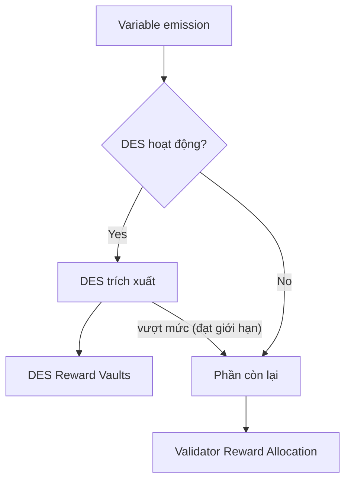

Proof-of-Liquidity quản lý block reward và token emission trên Berachain bằng token `$BGT`. Trang này giải thích nguyên tắc toán học đằng sau lựa chọn validator, block reward và tính emission.

## Lựa chọn validator

Mạng duy trì active set **69 validator** đủ điều kiện sản xuất block. Tiêu chí lựa chọn gồm:

- Chỉ **69 validator** hàng đầu theo stake `$BERA` được đưa vào active set
- Xác suất đề xuất block tỷ lệ với `$BERA` đã stake và không ảnh hưởng số lượng reward
- Giới hạn stake mỗi validator:
  - Tối thiểu: 250.000 `$BERA`
  - Tối đa: 10.000.000 `$BERA`

Xác suất một validator được chọn sản xuất block là tỷ trọng stake của validator so với tổng stake của active set.

## Cấu trúc emission $BGT

Khi validator sản xuất block, token `$BGT` được emit qua hai thành phần emission:

1. Base Emission
   - **Số lượng cố định** bằng tham số `base rate` (B)
   - Trả trực tiếp cho validator sản xuất block

2. Reward Vault Emission
   - **Số lượng biến đổi** phụ thuộc boost của validator (x)
     - tức phần trăm tổng `$BGT` delegate cho validator
   - Phân phối tới [Reward Vaults](/vi/general/proof-of-liquidity/reward-vaults) do validator chọn
     - Tỷ lệ với trọng số cấu hình trong Reward Allocation của validator
     - Validator nhận [Incentives](/vi/general/proof-of-liquidity/incentives) từ project theo số lượng hướng tới Reward Vaults của họ

## Boost validator

Boost là chỉ số quyết định emission reward của validator:

- Tính bằng phần trăm delegation `$BGT` của validator so với tổng `$BGT` delegate trong mạng
- Biểu diễn bằng số thập phân từ 0 đến 1
- Ví dụ: Nếu validator có 1000 `$BGT` delegate và mạng có tổng 10000 `$BGT` delegate, boost của họ là 0,1 (10%). Boost cao hơn dẫn tới emission reward cao hơn, theo công thức emission.

## BeraChef: Quản lý phân bổ reward

BeraChef là contract cốt lõi quản lý cách validator hướng reward BGT của họ tới các Reward Vaults khác nhau. Nó đóng vai trò lớp cấu hình xác định phân phối reward theo preference của validator.

### Trách nhiệm cốt lõi

BeraChef quản lý ba khía cạnh chính của hệ thống reward:

1. **Reward Allocations** — Duy trì danh sách trọng số xác định phần trăm reward tới mỗi Reward Vault
2. **Validator Commission** — Quản lý tỷ lệ commission validator có thể thu trên incentive token
3. **Vault Whitelisting** — Kiểm soát vault nào đủ điều kiện nhận reward BGT

### Cách reward allocations hoạt động

Mỗi validator có thể đặt reward allocation tùy chỉnh chỉ rõ reward BGT của họ nên được phân phối thế nào.

Reward Allocations được mô tả bởi:

1. Danh sách vault được chọn và phần trăm reward BGT của block đó gửi cho mỗi vault. Tổng trọng số phải bằng 100.
2. Số block khi allocation có hiệu lực.

Validator thực hiện quyền điều khiển reward allocation BeraChef với độ trễ 450 block.

**Nếu validator không cập nhật cutting board trong 302.400 block (khoảng 7 ngày),** BeraChef sẽ bắt đầu áp dụng cutting board _baseline_. Allocation _baseline_ này được chọn để hướng emission hiệu quả tới reward vaults có incentive đang active.

### Quản lý commission

BeraChef quản lý tỷ lệ commission của validator trên incentive token với các ràng buộc sau:

- **Commission mặc định**: 5% nếu không đặt rõ
- **Commission tối đa**: Hard cap 20% do contract thực thi
- **Độ trễ thay đổi**: Thời gian chờ bắt buộc trước khi thay đổi commission có hiệu lực

## Emission $BGT mỗi block

Tổng `$BGT` emit mỗi block được tính bằng công thức:

$$emission = \left[B + \max\left(m, (a + 1)\left(1 - \frac{1}{1 + ax^b}\right)R\right)\right]$$

### Tham số

| Tham số                       | Mô tả                                                    | Tác động                                         |
| ----------------------------- | -------------------------------------------------------- | ------------------------------------------------- |
| x (boost)                     | Phần trăm tổng `$BGT` delegate cho validator (khoảng: [0,1]) | Xác định emission `$BGT` tới Reward Vaults      |
| B (base rate)                 | Số lượng `$BGT` cố định cho sản xuất block               | Xác định reward validator cơ sở                  |
| R (reward rate)               | Số lượng `$BGT` cơ sở cho reward vaults                 | Đặt nền tảng cho emission reward                  |
| a (boost multiplier)          | Hệ số tác động boost                                    | Giá trị cao hơn tăng tầm quan trọng của boost    |
| b (convexity parameter)       | Độ dốc đường cong tác động boost                        | Giá trị cao hơn phạt nặng hơn với boost thấp     |
| m (minimum boosted reward rate) | Sàn emission reward vault                              | Giá trị cao hơn có lợi cho validator boost thấp  |

Công thức này mô tả tổng variable emission cho một block. Nếu [Dedicated emission stream](#dedicated-emission-stream) đang hoạt động, một phần sẽ được chuyển đến DES vault trước khi phần còn lại đến reward allocation của validator.

### Biểu đồ emission mẫu

Với các tham số mẫu sau, biểu đồ dưới cho thấy emission scale theo delegation `$BGT`:

$$B = 0.4, R = 1.1, a = 3.5, b = 0.4, m = 0$$

<Frame>
  
</Frame>

## Lạm phát block tối đa

Emission `$BGT` tăng theo lượng boost validator có, tới một giới hạn. Emission block lý thuyết tối đa xảy ra ở 100% boost:

$$\max \mathbb{E}[\text{emission}] = \left[B + \max(m, aR)\right]$$

## Dedicated emission stream

Trước khi reward allocation của validator được áp dụng, Distributor có thể trích một phần variable emission và chuyển đến một tập reward vault được governance chỉ định. Cơ chế này gọi là **Dedicated Emission Stream (DES)**.

Contract `DedicatedEmissionStreamManager` kiểm soát ba tham số, tất cả được thiết lập bởi governance:

- **`emissionPerc`** — tỷ lệ phần trăm variable reward mỗi block bị trích, tính bằng basis points trên tổng 10,000. Giá trị 500 nghĩa là 5%.
- **`targetEmission`** — giới hạn tích lũy cho mỗi vault. Khi vault đã nhận đủ lượng DES emission mục tiêu, vault đó ngừng nhận thêm. Phần vượt mức được trả về reward allocation của validator cho block đó.
- **Reward allocation weights** — danh sách reward vault trong whitelist và phần mỗi vault nhận trong phần trích, sử dụng cùng định dạng weight như BeraChef (tổng tỷ lệ phải bằng 100%).

### Ảnh hưởng đến validator

Phần DES trích xuất giảm effective variable reward mà validator có thể phân bổ. Nếu `emissionPerc` được đặt là 5%, validator tạo block sẽ nhận 95% variable emission để phân phối theo BeraChef reward allocation. Base emission (trả trực tiếp cho validator operator) không bị ảnh hưởng.

Các tham số DES hiện tại — bao gồm tỷ lệ trích xuất, vault mục tiêu, và giới hạn mỗi vault — có thể đọc từ contract [`DedicatedEmissionStreamManager`](/build/getting-started/deployed-contracts) on-chain.

## Phân phối $BGT

Distributor emit `$BGT` tới reward vaults theo từng block. Mạng xử lý phân phối cho block đã cho trong block tiếp theo. Điều này tạo ra `$BGT` mà Reward Vault staker sau đó có thể claim.

Mạng tạo reward theo từng block; tuy nhiên phân phối chúng **trong khoảng thời gian ba ngày.** Người deposit nhận reward stream tuyến tính trong khoảng thời gian này, tỷ lệ với số tiền deposit. Cửa sổ reward reset mỗi khi reward mới đến.

### Ví dụ phân phối

Trên Berachain, `$BGT` được phân phối theo block, nghĩa là khoảng thời gian phân phối ba ngày liên tục bị "đẩy" để "bắt đầu" ở block hiện tại. Do đó khoảng thời gian này nên được xem như sliding window dựa trên emission tại bất kỳ thời điểm nào trong ba ngày trước.

Ví dụ thực tế hơn với số đơn giản hóa:

- 3 `$BGT` phân phối mỗi ngày, tổng 27 trong 9 ngày
- 1 người deposit, sở hữu toàn bộ deposit

<Frame>
  
</Frame>

**Chú thích**

- Emitted: Tổng số `$BGT` phân phối và có sẵn
- Claimable: Tổng số `$BGT` người deposit có thể claim
- Daily Reward: Số `$BGT` hàng ngày được đánh dấu claimable dựa trên unlock token emitted

Kết quả là người deposit nhận lượng `$BGT` tăng dần mỗi ngày cho đến khi reward đạt điểm bão hòa sau ba ngày, khi mọi reward đang được phân phối tích cực.

Các khoảng duration reward khuyến khích sự căn chỉnh hệ sinh thái với người deposit qua cơ chế phân phối này thay vì cho phép reward được claim ngay lập tức.

## Tính APR Boost

APR Boost được hiển thị trên [Berachain Hub](https://hub.berachain.com).

<Frame>
  
</Frame>

Phần trăm APR Boost được tính bằng các khoảng block, xác định bởi block bắt đầu và block kết thúc. Tại thời điểm tính phần trăm, máy tính APR lấy mẫu giá của tất cả token (tính bằng $BERA).
