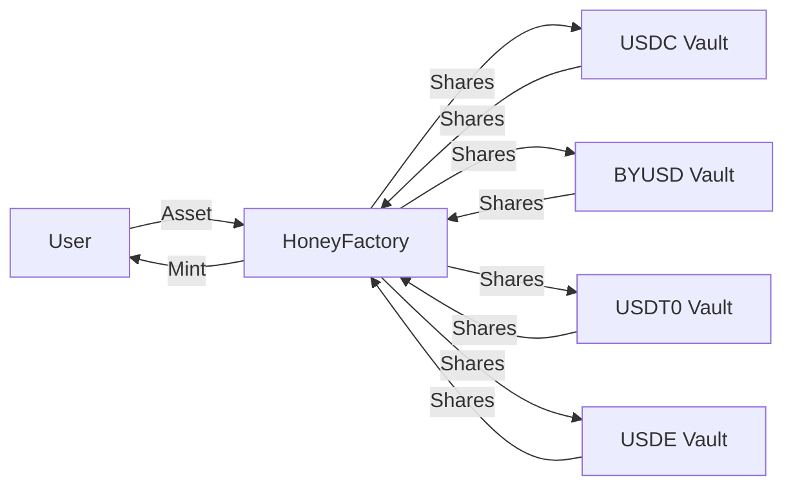

`$HONEY` được soft-pegged với Đô la Mỹ và thế chấp đầy đủ. Đây là stablecoin gốc của Berachain, cung cấp phương tiện trao đổi ổn định trong và ngoài hệ sinh thái.

## Sử dụng và mint $HONEY

`$HONEY` đóng vai trò giống các stablecoin khác — thanh toán, chuyển tiền, phòng ngừa biến động — và được sử dụng rộng rãi trong DeFi Berachain làm cặp giao dịch cơ sở và tài sản cho vay. Mint và redeem `$HONEY` bằng collateral thực hiện qua [HoneySwap](https://honey.berachain.com). Bạn cũng có thể swap trên BEX hoặc sàn khác.

Vòng đời rất đơn giản: deposit tài sản collateral đã whitelist để mint `$HONEY`, sử dụng tùy ý, và redeem lấy collateral khi hoàn tất. Tỷ lệ mint và redeem được cấu hình theo từng tài sản collateral bởi governance `$BGT`.

### Tài sản collateral

Các tài sản sau có thể dùng làm collateral để mint `$HONEY`:

- `$USDC`
- `$BYUSD` (`$pyUSD`)
- `$USDT0`
- `$USDE`

Tài sản collateral mới có thể được thêm qua governance.

## Kiến trúc $HONEY

Sơ đồ luồng quy trình mint `$HONEY` và các contract liên quan:

### Các vault $HONEY

`$HONEY` được mint bằng cách deposit collateral đủ điều kiện vào các contract vault chuyên dụng. Mỗi vault tương ứng với một loại collateral. Tỷ lệ mint và redeem được cấu hình độc lập cho từng loại collateral — xem [Phí](#phí) để biết giá trị hiện tại.

### Lưu ký collateral

Governance có thể chỉ định một vault là vault lưu ký bằng cách đặt địa chỉ bên lưu ký. Khi lưu ký được bật, collateral deposit sẽ tự động được chuyển từ contract vault đến bên lưu ký. Khi redeem, collateral được rút từ bên lưu ký trước khi trả về cho user. Hệ thống kế toán share của vault không bị ảnh hưởng — tỷ lệ quy đổi 1:1 giữa collateral và vault share được duy trì bất kể tài sản cơ sở được giữ ở đâu.

Governance có thể gỡ bỏ lưu ký, khi đó toàn bộ collateral được chuyển từ bên lưu ký về contract vault.

### HoneyFactory

Trung tâm quy trình mint `$HONEY` là contract [`HoneyFactory`](https://beratrail.io/address/0xA4aFef880F5cE1f63c9fb48F661E27F8B4216401) (cùng địa chỉ trên mainnet và Bepolia). Contract này đóng vai trò hub trung tâm, kết nối tất cả vault `$HONEY` và chịu trách nhiệm mint token `$HONEY` mới.

Như trong sơ đồ, deposit của bạn được định tuyến qua contract HoneyFactory tới vault tương ứng. HoneyFactory giữ shares do vault mint (tương ứng deposit của bạn) và mint token `$HONEY` cho bạn.

## Depeg và chế độ basket

Basket Mode là cơ chế an toàn kích hoạt khi tài sản collateral trở nên không ổn định. Nó ảnh hưởng cả mint và redeem `$HONEY` theo cách cụ thể:

**Redeem:**

- Khi BẤT KỲ tài sản collateral nào depeg, Basket Mode tự động kích hoạt
- Ở chế độ này bạn không thể chọn redeem `$HONEY` lấy tài sản nào
- Thay vào đó bạn redeem lấy phần tỷ lệ của TẤT CẢ tài sản collateral trong basket
- Ví dụ: nếu redeem 1 token `$HONEY` khi Basket Mode active, bạn nhận một ít mỗi tài sản collateral theo tỷ lệ tương đối của chúng làm collateral

**Mint:**

- Basket Mode cho mint được xem là edge case chỉ xảy ra nếu TẤT CẢ tài sản collateral đều depeg hoặc bị blacklist. Tài sản depeg không thể dùng để mint `$HONEY`
- Trong tình huống đó, để mint `$HONEY` bạn phải cung cấp lượng tỷ lệ của tất cả tài sản collateral trong basket, thay vì chọn một tài sản
- Nếu một tài sản depeg, bạn chỉ có thể mint bằng tài sản còn lại

## Phí

Người nắm giữ `$BGT` nhận phí thu từ mint và redeem `$HONEY`. Cấu trúc phí hiện tại:

| Stablecoin | Phí Mint | Phí Redeem |
| ---------- | -------- | ---------- |
| USDT       | 0,1%     | 0%         |
| byUSD      | 0,1%     | 0%         |
| USDC       | 0%       | 0,05%      |
| USDe       | 0%       | 0,05%      |

### Ví dụ

Mint và redeem `$HONEY` với `$USDC`:

**Mint:**

- User deposit `1.000 $USDC`
- Nhận `1.000 $HONEY` (0% phí)
- Không thu phí

**Redeem:**

- User redeem `1.000 $HONEY` lấy `$USDC`
- Nhận `999,5 $USDC` (0,05% phí = 0,5 $USDC)
- Phí `0,5 $USDC` được phân phối cho người nắm giữ `$BGT`

## Chuyển và phê duyệt không gas

`$HONEY` hỗ trợ hai extension ERC-20 cho phép bên thứ ba gửi giao dịch thay mặt người giữ token, loại bỏ nhu cầu người giữ phải trả gas:

- **EIP-2612 `permit`** — cho phép người giữ ký thông điệp off-chain để ủy quyền hạn mức chi tiêu. Relayer hoặc contract sau đó có thể gửi permit lên on-chain, người giữ không cần gửi giao dịch. Đây là interface tương tự được sử dụng bởi USDC, DAI và hầu hết các ERC-20 token hiện đại.
- **EIP-3009 `transferWithAuthorization` / `receiveWithAuthorization`** — cho phép người giữ ký thông điệp off-chain để ủy quyền chuyển một lần đến người nhận cụ thể. Người nhận (hoặc relayer) gửi lên on-chain. Mỗi ủy quyền bao gồm nonce duy nhất để chống replay.

Cả hai extension đều sử dụng [EIP-712](https://eips.ethereum.org/EIPS/eip-712) typed structured data cho chữ ký.
