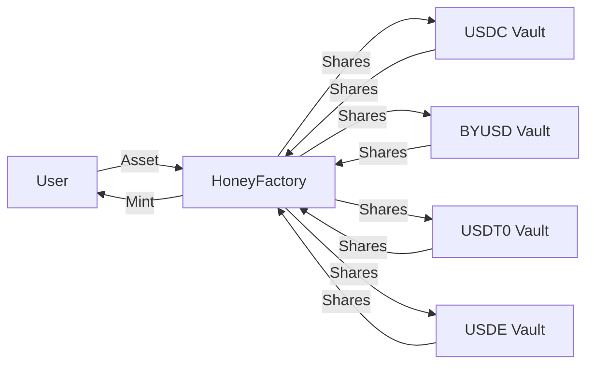

`$HONEY` là stablecoin gốc của Berachain, được thiết kế để cung cấp phương tiện trao đổi ổn định và đáng tin cậy trong và ngoài hệ sinh thái Berachain. `$HONEY` được thế chấp đầy đủ và soft-pegged với Đô la Mỹ.

## Cách lấy $HONEY

`$HONEY` có thể được mint bằng cách deposit collateral đã whitelist vào vault và mint `$HONEY` chống lại collateral đó qua [dApp HoneySwap](https://honey.berachain.com). Tỷ lệ mint `$HONEY` có thể được cấu hình bởi governance `$BGT` cho từng tài sản collateral khác nhau.

Ngoài ra có thể lấy `$HONEY` bằng cách swap từ tài sản khác trên BEX hoặc sàn phi tập trung khác.

### Tài sản collateral

Các tài sản sau có thể dùng làm collateral để mint `$HONEY`:

- `$USDC`
- `$BYUSD` (`$pyUSD`)
- `$USDT0`
- `$USDE`

Tài sản mới dùng để mint `$HONEY` có thể được thêm qua governance.

## $HONEY dùng để làm gì?

`$HONEY` dùng giống các stablecoin khác, chẳng hạn thanh toán/chuyển tiền và phòng ngừa biến động thị trường. `$HONEY` cũng có thể dùng trong hệ sinh thái DeFi Berachain.

## Kiến trúc $HONEY

Sơ đồ luồng quy trình mint `$HONEY` và các contract liên quan:

### Các vault $HONEY

`$HONEY` được mint bằng cách deposit collateral đủ điều kiện vào các contract vault chuyên dụng. Mỗi vault tương ứng với một loại collateral. Hiện tất cả vault dùng cùng tỷ lệ chuyển đổi: 100% tỷ lệ mint (0% phí mint) và 99,95% tỷ lệ redeem (0,05% phí redeem).

### HoneyFactory

Trung tâm quy trình mint `$HONEY` là contract HoneyFactory. Contract này đóng vai trò hub trung tâm, kết nối tất cả vault `$HONEY` và chịu trách nhiệm mint token `$HONEY` mới.

Như trong sơ đồ, deposit của bạn được định tuyến qua contract HoneyFactory tới vault tương ứng. HoneyFactory giữ shares do vault mint (tương ứng deposit của bạn) và mint token `$HONEY` cho bạn.

## Depeg và chế độ basket

Basket Mode là cơ chế an toàn kích hoạt khi tài sản collateral trở nên không ổn định. Nó ảnh hưởng cả mint và redeem `$HONEY` theo cách cụ thể:

**Redeem:**

- Khi BẤT KỲ tài sản collateral nào depeg, Basket Mode tự động kích hoạt
- Ở chế độ này bạn không thể chọn redeem `$HONEY` lấy tài sản nào
- Thay vào đó bạn redeem lấy phần tỷ lệ của TẤT CẢ tài sản collateral trong basket
- Ví dụ: nếu redeem 1 token `$HONEY` khi Basket Mode active, bạn nhận một ít mỗi tài sản collateral theo tỷ lệ tương đối của chúng làm collateral

**Mint:**

- Basket Mode cho mint được xem là edge case chỉ xảy ra nếu TẤT CẢ tài sản collateral đều depeg hoặc bị blacklist. Tài sản depeg không thể dùng để mint `$HONEY`
- Trong tình huống đó, để mint `$HONEY` bạn phải cung cấp lượng tỷ lệ của tất cả tài sản collateral trong basket, thay vì chọn một tài sản
- Nếu một tài sản depeg, bạn chỉ có thể mint bằng tài sản còn lại

## Phí

Người nắm giữ `$BGT` nhận phí thu từ mint và redeem `$HONEY`. Cấu trúc phí hiện tại:

| Stablecoin | Phí Mint | Phí Redeem |
| ---------- | -------- | ---------- |
| USDT       | 0,1%     | 0%         |
| byUSD      | 0,1%     | 0%         |
| USDC       | 0%       | 0,05%      |
| USDe       | 0%       | 0,05%      |

### Ví dụ

Mint và redeem `$HONEY` với `$USDC`:

**Mint:**

- User deposit `1.000 $USDC`
- Nhận `1.000 $HONEY` (0% phí)
- Không thu phí

**Redeem:**

- User redeem `1.000 $HONEY` lấy `$USDC`
- Nhận `999,5 $USDC` (0,05% phí = 0,5 $USDC)
- Phí `0,5 $USDC` được phân phối cho người nắm giữ `$BGT`
